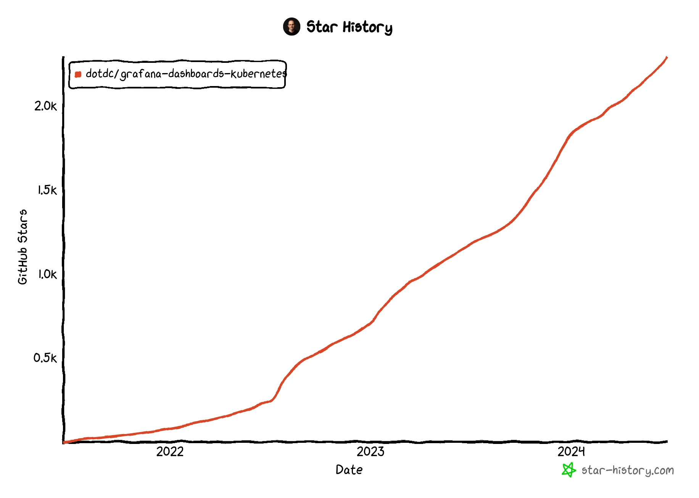
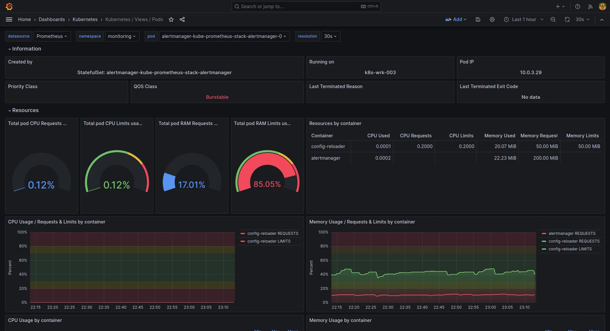
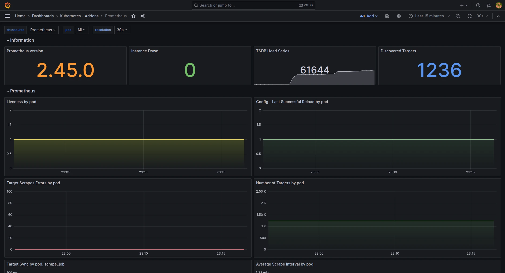
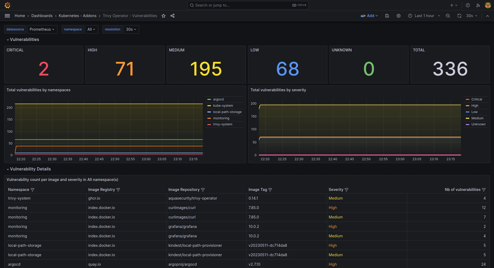

+++
author = "David Calvert"
title = "An updated set of Grafana dashboards for Kubernetes"
date = "2024-06-26"
description = "An updated set of Grafana dashboards for Kubernetes"
tags = [
    "observability", "kubernetes", "monitoring", "grafana"
]
categories = [
    "tech"
]
canonicalUrl = "https://medium.com/@dotdc/an-updated-set-of-grafana-dashboards-for-kubernetes-f5d6e4ff5072"
thumbnail = "/img/thumbs/grafana-dashboards-kubernetes.webp"
featureImage = "grafana-dashboards-kubernetes-banner.webp"
featureImageAlt = 'Banner of the grafana-dashboards-kubernetes project'
+++

> This article was originally published on [Medium](https://medium.com/@dotdc/an-updated-set-of-grafana-dashboards-for-kubernetes-f5d6e4ff5072).

<!--more-->

## Introduction

Two years ago, I published [A set of modern Grafana dashboards for Kubernetes](https://0xdc.me/blog/a-set-of-modern-grafana-dashboards-for-kubernetes/) to share the dashboards I created for Kubernetes with the community. In this article, I'll provide an update on the project and walk through the main changes that have been made since then.

## Project's updates

The [dotdc/grafana-dashboards-kubernetes](https://github.com/dotdc/grafana-dashboards-kubernetes) project has evolved significantly over the last two years! Following several retweets, both the original article and the project saw a noticeable increase in traffic, which also brought several new contributors. I was surprised to see so many people from all around the world [using my dashboards](https://github.com/search?q=dotdc%2Fgrafana-dashboards-kubernetes&type=code) in their home labs or in companies such as Rakuten, Orange, Swisscom, and Nokia. Some projects even directly embedded the dashboards, such as [Victoria Metrics](https://github.com/VictoriaMetrics/helm-charts/blob/master/charts/victoria-metrics-k8s-stack/hack/sync_grafana_dashboards.py#L48), the [GCP Cloud Foundation Fabric](https://github.com/GoogleCloudPlatform/cloud-foundation-fabric/tree/master/blueprints/gke/autopilot/bundle/monitoring/dashboards) and the [Microsoft Azure Arc Jumpstart](https://github.com/microsoft/azure_arc/blob/main/azure_jumpstart_ag/artifacts/monitoring/grafana-cluster-global.json).

Here are the current project statistics:

- ~5 million dashboards downloads ([grafana.com](https://grafana.com/grafana/dashboards/?plcmt=top-nav&cta=downloads&search=dotdc) only!)
- 2293 GitHub stars
- 337 forks
- 26 contributors

[Star History Chart](https://star-history.com/#dotdc/grafana-dashboards-kubernetes)

## Changes

### General changes

Following community demand, the project now has proper [releases](https://github.com/dotdc/grafana-dashboards-kubernetes/releases) that are automatically generated using a semantic releaser, which leverages [conventional commits](https://www.conventionalcommits.org/en/v1.0.0/) to create versions following [semantic versioning](https://semver.org).

Additionally, all dashboards now include a `cluster` variable support, which was implemented with a safe and straightforward solution as documented in [issue #15](https://github.com/dotdc/grafana-dashboards-kubernetes/issues/15).
This enables users of tools like [Thanos](https://github.com/thanos-io/thanos), [Mimir](https://github.com/grafana/mimir), or any other federated or highly available setups to enjoy enhanced compatibility.

Furthermore, new panels have been added to visualize CPU throttling across all "views" dashboards.

### k8s-views-pods.json

Building on ideas from [issue #21](https://github.com/dotdc/grafana-dashboards-kubernetes/issues/21) and further work, k8s-views-pods.json has received a major update! Among the changes are several new information panels displaying priority class, QoS class, last terminated reason, and last terminated exit code.

Additionally, two new panels have been added: one compares CPU requests and limits to actual CPU usage, and the other does the same for memory. This helps to better visualize container resource usage and simplifies container sizing.

### k8s-addons-prometheus.json

The project now includes a dashboard for Prometheus with panels related to Prometheus instances, TSDB, query engine, resources, storage, and network.

### k8s-addons-trivy-operator.json

The k8s-addons-starboard-operator.json which used the Giant Swarm [starboard-exporter](https://github.com/giantswarm/starboard-exporter) has been replaced in favor of  k8s-addons-trivy-operator.json, based on metrics from the [trivy-operator](https://github.com/aquasecurity/trivy-operator) of Aqua Security.

### Changelog

k8s-views-global.json:

- added throttled cpu ([0427a7f](https://github.com/dotdc/grafana-dashboards-kubernetes/commit/0427a7f1881c10c200173501170c38bac2ba926b))
- added cluster variable ([3d99847](https://github.com/dotdc/grafana-dashboards-kubernetes/commit/3d998472b5ccd9ddcde72e080c9c323be496a752))

k8s-views-namespaces.json:

- added throttled cpu panels ([dbf01b1](https://github.com/dotdc/grafana-dashboards-kubernetes/commit/dbf01b17628642bda8e02bf9283f95ca2363f79b))
- ability to filter on a specific deployments, statefulsets or deamonsets ([d173be7](https://github.com/dotdc/grafana-dashboards-kubernetes/commit/d173be73556bc98dc46950aebb2995fdde61be89))
- added cluster variable ([7ac58e5](https://github.com/dotdc/grafana-dashboards-kubernetes/commit/7ac58e53a4a0c2380a504cd233ead36977d18cc2))

k8s-views-nodes.json:

- added links from nodes to pods ([50d1aa6](https://github.com/dotdc/grafana-dashboards-kubernetes/commit/50d1aa6d0c1cffacffdb126b891ab8074af70d9f))
- added throttled cpu panels ([d223755](https://github.com/dotdc/grafana-dashboards-kubernetes/commit/d223755205136267557aef67702579c98ba72dd9))

k8s-views-pods.json:

- rework the pods dashboard with ideas ([9d11d49](https://github.com/dotdc/grafana-dashboards-kubernetes/commit/9d11d498a61fc4155deb7fa35eddcb1554c84e80))
- added throttled cpu panels ([d223755](https://github.com/dotdc/grafana-dashboards-kubernetes/commit/d223755205136267557aef67702579c98ba72dd9))
- added links from pods to nodes ([df42ae5](https://github.com/dotdc/grafana-dashboards-kubernetes/commit/df42ae511ca17e5667459d5f3bfdd1abed104676))
- added oom and restarts ([ab62016](https://github.com/dotdc/grafana-dashboards-kubernetes/commit/ab6201685e2309b368ab1876a94c84c4f316fb17))
- added cluster variable ([7ac58e5](https://github.com/dotdc/grafana-dashboards-kubernetes/commit/7ac58e53a4a0c2380a504cd233ead36977d18cc2))
- added multi pod select ([03281bf](https://github.com/dotdc/grafana-dashboards-kubernetes/commit/03281bf6b40cdfdf669f7b0090ea4e30302c28eb))

Other changes:

- Semantic releases ([b7d3553](https://github.com/dotdc/grafana-dashboards-kubernetes/commit/b7d3553a34b3742db92cb37b1b094ad1cf2129c6))
- Added ArgoCD deployment ([3518826](https://github.com/dotdc/grafana-dashboards-kubernetes/commit/35188264afcf3684d9aa1b19ffadefeb2373e4c4))
- Many bug fixes and small improvements

## Final words

I hope that this article was useful and that it gave additional information over the [original article](https://0xdc.me/blog/a-set-of-modern-grafana-dashboards-for-kubernetes/)!

It has been truly rewarding to receive [feedback](https://github.com/dotdc/grafana-dashboards-kubernetes/issues?q=is%3Aissue+is%3Aclosed), [compliments](https://www.reddit.com/r/kubernetes/comments/1ctwivj/comment/l4f13xy/?utm_source=share&utm_medium=web3x&utm_name=web3xcss&utm_term=1&utm_content=share_button), [ideas](https://github.com/dotdc/grafana-dashboards-kubernetes/issues/107), and engage in [technical discussions](https://github.com/dotdc/grafana-dashboards-kubernetes/issues/80) with the community. This ultimately led me to join the [Grafana Champion](https://grafana.com/community/champions/) program. Thank you! ❤️

Your feedback and suggestions are always welcome, so feel free to contribute to this project:

- Give a [GitHub ⭐](https://github.com/dotdc/grafana-dashboards-kubernetes/stargazers) if you like it
- Create an [Issue](https://github.com/dotdc/grafana-dashboards-kubernetes/issues) to make a feature request, report a bug or share an idea.
- Create a [Pull Request](https://github.com/dotdc/grafana-dashboards-kubernetes/pulls) if you want to share code or anything useful to this project.

You can also follow me on:

- GitHub : [https://github.com/dotdc](https://github.com/dotdc)
- Mastodon : [https://hachyderm.io/@0xDC](https://hachyderm.io/@0xDC)
- Twitter : [https://twitter.com/0xDC_](https://twitter.com/0xDC_)
- LinkedIn : [https://www.linkedin.com/in/0xDC](https://www.linkedin.com/in/0xDC)

👋
