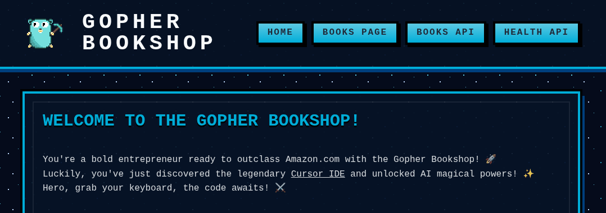

+++
author = "David Calvert"
title = "Creating a Cursor workshop developers enjoy doing"
date = "2025-11-11"
description = "Creating a Cursor workshop developers enjoy doing"
tags = [
    "AI", "Cursor", "Workshop"
]
categories = [
    "tech"
]
#canonicalUrl = ""
thumbnail = "/img/thumbs/cursor.webp"
featureImage = "cursor-workshop-banner.webp"
featureImageAlt = 'The Cursor workshop banner'
+++

## Introduction

A few weeks ago, my friend [Donia](https://www.linkedin.com/in/donia-chaiehloudj/) started asking me questions about [Cursor](https://cursor.com), the AI coding editor, because she knew I was working with it and wanted to learn how I was using it. She was really interested, and since she's also a founding member of the Google Developer Group in Sophia-Antipolis, she asked if I would be willing to prepare a workshop on Cursor for the local community.

## Goal

The goal was to organize a local event limited to 40 people, starting with a Cursor presentation led by [Michèle](https://www.linkedin.com/in/michele-legait/) ([slides](https://docs.google.com/presentation/d/1rjCuA0mfH_Csq4sM7IhhGjgNEGduKKvCKOyYUSZi8Uc)), followed by a hands-on workshop to discover the tool, which I volunteered to prepare.

I've been involved with local tech communities since March 2016, participated in many events, and contributed to several, especially by co-organizing and preparing technical talks for the local [Docker User Group](https://www.meetup.com/docker-nice/) and [Sophia-Antipolis HashiCorp User Group](https://www.meetup.com/fr-FR/sophia-antipolis-hashicorp-user-group/). However, I had never organized or built an entire workshop before.

## Building the workshop

I never really participated in workshops myself. I mostly learned by hacking solo at home or at work with the help of teammates. So I thought about what would make one enjoyable and decided to build the kind of workshop I'd like to do, one that lets you learn while having fun and keeps you entertained and motivated all the way through.

I decided to create a small web application so participants could easily modify and visualize their changes.

Script:

> You're a bold entrepreneur ready to outclass Amazon.com with the `{Gopher|Snake|Typed}` Bookshop! 🚀\
> Luckily, you've just discovered the legendary Cursor IDE and unlocked AI magical powers! ✨\
> Hero, grab your keyboard, the code awaits! ⚔️

I wanted the workshop to be available in several programming languages so people could choose the one they felt most comfortable with. It's available in three versions:

- `golang-workshop`: The Gopher Bookshop, the Golang version.
- `python-workshop`: The Snake Bookshop, the Python version.
- `typescript-workshop`: The Typed Bookshop, the TypeScript version.

> 🚀 **Learn Cursor with this workshop**\
> The workshop is open-source and hosted on GitHub.\
> You can complete most of it using [Cursor's free tier](https://cursor.com/pricing) (Auto Mode).\
> 👉 Repository: <https://github.com/dotdc/cursor-workshop>

## Workshop Quests

Here's a summary of the workshop quests and their purpose.

| Title | Purpose |
| --- | --- |
| The Frenchy's Typo | Fix a tiny typo to feel Cursor's tab-autocomplete magic. |
| From Shakespeare to Molière | Configure Cursor's rules to alter LLM interaction with funny prompts. |
| The Eternal Year Problem | Implement a tiny feature with Cursor's assistive workflow. |
| The Missing Search Feature | See how Cursor can speed up common tasks by adding a search feature. |
| The Caffeinated Artist | Demonstrate how Cursor can use images to troubleshoot rendering issues. |
| The Hidden Easter Egg | See how Cursor can help with codebase discovery based on an assumption. |
| Trekkie Health Check | Another funny exercise to show how Cursor can assist on feature development. |
| The Rust Rewrite | Go as far as translating an entire project from a language to another. |
| The Forgotten TDD Course | Use Cursor to generate and refine unit tests on existing code. |
| The Documentalist | Create project documentation quickly with Cursor's help. |

## The event

The event took place on Thursday, November 6, at Datadog's offices in Sophia-Antipolis.

**Program:**

- **Presentation (30 min):** Introduction to Cursor: description, features, modes, and much more. ([slides](https://docs.google.com/presentation/d/1rjCuA0mfH_Csq4sM7IhhGjgNEGduKKvCKOyYUSZi8Uc))
- **Workshop (1 h):** Get hands-on with the workshop and enjoy a few surprises. ([repository](https://github.com/dotdc/cursor-workshop))
- **Conclusion (15 min):** Key takeaways, going further and open Q&A.
- **Networking & Food:** Drinks, snacks, and great conversations with participants, speakers, and organizers.

The event went really well. Everyone already had Cursor installed and was able to complete the workshop exercises. I was happy to see that most people finished within the allotted time. During networking, I had some great discussions and questions about generative AI tools for coding, and received very positive feedback!

## Final words

It was fun to prepare this workshop, and I'm glad people enjoyed it! Thanks to the other organizers from [JSSophia](https://www.linkedin.com/company/jssophia/) and [GDG Sophia-Antipolis](https://www.linkedin.com/company/gdg-sophia-antipolis/) for their initiative, [Ben](https://www.linkedin.com/in/benmlang/) from Cursor for providing vouchers and swag, and Datadog for hosting the event. See you next time for another one, maybe on [MCP](https://modelcontextprotocol.io) servers!

You can also follow me on:

- GitHub : [https://github.com/dotdc](https://github.com/dotdc)
- LinkedIn : [https://www.linkedin.com/in/0xDC](https://www.linkedin.com/in/0xDC)
- Bluesky : [https://bsky.app/profile/0xdc.me](https://bsky.app/profile/0xdc.me)
- Twitter : [https://twitter.com/0xDC_](https://twitter.com/0xDC_)

👋
