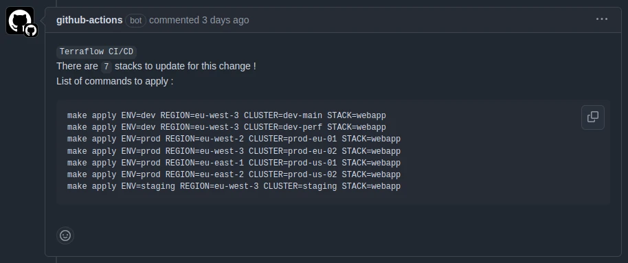
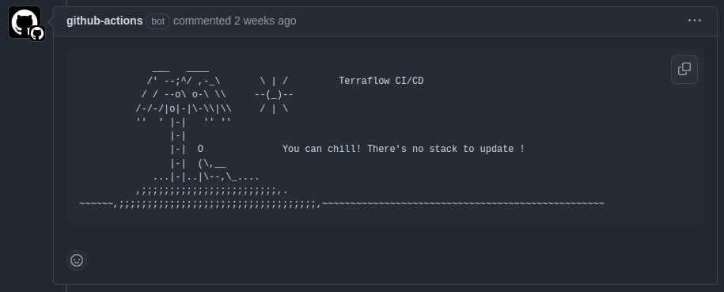
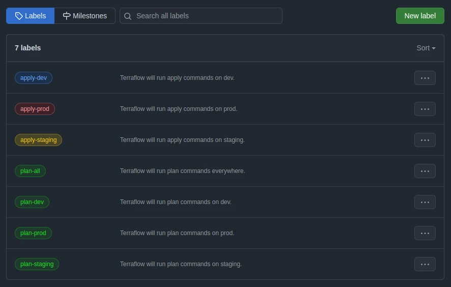
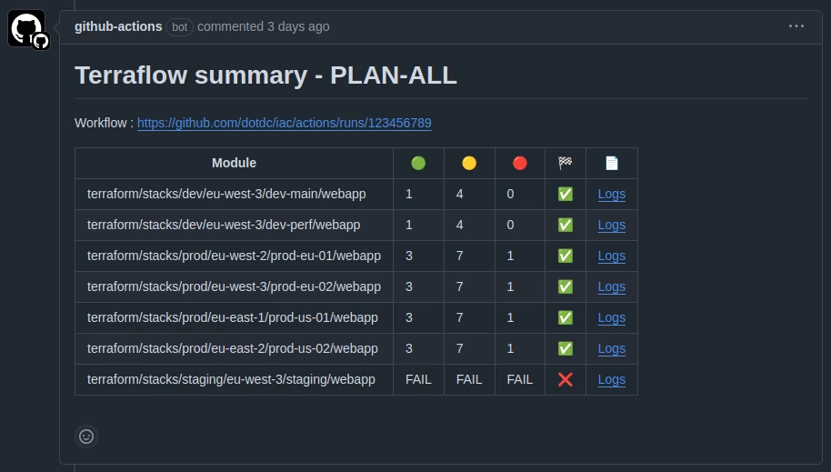

+++
author = "David Calvert"
title = "Creating Terraflow, a CI/CD orchestrator to scale Terraform"
date = "2024-10-30"
description = "Creating Terraflow, a CI/CD orchestrator to scale Terraform"
tags = [
    "terraform", "cicd", "git", "github"
]
categories = [
    "tech"
]
canonicalUrl = "https://medium.com/@dotdc/creating-terraflow-a-ci-cd-orchestrator-to-scale-terraform-3965b3f8931f"
thumbnail = "/img/thumbs/terraflow.webp"
featureImage = "terraflow-banner.webp"
featureImageAlt = 'The banner of Terraflow!'
+++

> This article was originally published on [Medium](https://medium.com/@dotdc/creating-terraflow-a-ci-cd-orchestrator-to-scale-terraform-3965b3f8931f).

## Introduction

Managing Terraform and Terragrunt at scale can be challenging! My team was spending much time identifying affected stacks and dealing with plan and apply processes, leading to increased drift risks. Existing solutions like Atlantis, Digger, and Spacelift didn’t fully meet our needs, so we decided to build our own! This article details why and how we developed Terraflow to have stack detection, manage dependencies, and simplify our deployment workflows.

Some refer to tools like Terraflow as [TACOS](https://itnext.io/spice-up-your-infrastructure-as-code-with-tacos-1a9c179e0783), which stands for Terraform Automation and Collaboration Software. TACOS frameworks are designed specifically to tackle the challenges of operating IaC at scale by streamlining automation, collaboration, and control across infrastructure deployments.

## Context

At Hivebrite, we have a moderately big monorepo which contains IaC templates, Terraform modules, Terraform models (profiles), and Terragrunt stacks. When making changes to this repository, everyone has to manually identify the affected stacks and then run the plan and apply operations. The scale and complexity make it really hard to not generate drift between the desired state and the live platforms.

Additionally, our Terragrunt operations are wrapped with a custom Makefile, which is responsible for starting a pre-configured container that contains all the necessary binaries, Terraform providers, observability plugins, and audit logs. This greatly reduces compatibility with existing "at scale" Terraform solutions.

## Tool comparison

In order to suit our needs, we’ve primarily focused on open-source options but also decided to include one enterprise solution for comparison. This is not an exhaustive comparison, as there are many more tools such as [Terrateam](https://terrateam.io/), [Scalr](https://www.scalr.com/), [Terraform Cloud](https://www.hashicorp.com/products/terraform/pricing), [Env0](https://www.env0.com/)...

### TL;DR

| Feature | Atlantis | Digger | Spacelift |
| ------- | ------ | -------- | --------- |
| Language | Go | Go | Go |
| Open-Source | ✅ | ✅ | ❌ |
| GitHub Integration | ✅ | ✅ | ✅ |
| Terragrunt Support | ✅ | ✅ | ✅ |
| Drift Detection | ❌ | ✅ | ✅ |
| PR Stack Detection | ❌ | ❌ | ⚠️ |
| Custom plan/apply scope | ✅ | ❌ | ✅ |
| Custom Commands Support | ✅ | ✅ | ✅ |
| Slack integration | ✅ | ⚠️ | ✅ |

### Atlantis

[Atlantis](https://github.com/runatlantis/atlantis) is the most used open-source pull request automation tool for Terraform. It has support for Terragrunt and custom plan/apply scope, but still lacks drift detection. The main concern we had was the fact that it doesn't have stack detection, which means no way to detect which stacks need to be updated when we make changes in our Terraform modules and models.

### Digger

[Digger](https://github.com/diggerhq/digger) is an open-source Terraform orchestration tool for teams. It was [originally written in Python](https://github.com/diggerhq/digger/commit/985690d44ea3f4358c0d03b518c2f6db6f470ccd), but they quickly [switched to Go](https://github.com/diggerhq/digger/commit/6791d0f827bc0ebff77dd8ebe1df9605da917cea). It supports Terragrunt and has Drift Detection on its paid offering, but it currently lacks support for custom plan/apply scope. Like Atlantis, Digger cannot detect which stacks need to be updated when we make changes in our Terraform modules and models. The Slack integration is not completely done, but they’re working on getting it right. They also have several paid plans that seem way cheaper than their competitors.

Good to know, all their offerings have no limits on private runners, resources under management or concurrency!

### Spacelift

[Spacelift](https://spacelift.io/) is _"The Most Flexible IaC Management Platform, and a sophisticated CI/CD platform for OpenTofu, Terraform, Terragrunt, CloudFormation, Pulumi, Kubernetes, and Ansible"_.

It is a commercial solution with the opinionated approach that [you shouldn’t manage Terraform with generic CI/CD tools](https://medium.com/spacelift/why-you-shouldnt-manage-terraform-with-generic-ci-cd-tools-4dd874ca7096).\
While they have a great product and most features we needed, the pricing model based on the number of concurrent workers was a huge blocker. You don't pay for what you use, but for the maximum concurrent parallel workers you need!

### Making a choice

All projects were actively developed and had a large or large enough community to engage with.\
Considering all the pros and cons, we decided to solve the problem ourselves!

The reasons behind this decision was mainly tied to:

- Time: we believe it's quicker to build a custom solution to solve this problem than what it would take to adopt, and contribute the missing part on an existing project. Also, this gives us the luxury to choose the interface.
- Reduced Risk: due to the custom nature of our repository, nothing guarantees that we would be able to merge our specific use-case in an upstream project.
- Quality: better integration with our existing code, we don't need to adapt or change what we already have, just build an additional wrapper around it.
- Knowledge: baking a custom solution gives us a better understanding of how things work.

## Creating Terraflow

> Terraflow is an internal, non-open-source tool. While much of this article is based on it, some details have been modified to simplify examples and protect sensitive company information.

The project started as a proof of concept to address our specific IaC needs. It quickly gained traction within the team, evolving into a widely-used solution. The name "Terraflow" was chosen by the team after several ideas were proposed. With the help of generative AI, we managed to create a visual identity for Terraflow in no time using [Artguru.ai](https://www.artguru.ai) to generate a dinosaur, [TextStudio](https://www.textstudio.com/logo/oreo-text-effect-1712) for the Oreo style title.

I began identifying the essential features we needed, along with additional nice-to-haves. Once prioritized, I organized them into a release plan that provided a logical development path.

Desired features:

- Parallel Execution
- GitHub Integration
- Terragrunt Support
- Drift Detection
- PR Stack Detection (blast radius of a change)
- Custom plan/apply scope
- Custom Commands Support
- Dependency tree
- Slack integration
- Ease of use (stack detection, rollout, logs, summary...)

I won’t cover everything in this article because there’s too much to cover, but I’ll go through the most interesting parts.

### Workflow

Terraflow runs within our CI/CD pipelines and when a new GitHub Pull Request is opened, we want to have the ability to see which stacks are affected by a particular change. We also want to have an easy way to do plan and apply commands on these affected stacks.

Here's the basic workflow:

1. Open a GitHub pull request
2. Stack detection will give you the list of affected stacks and commands to apply.
3. Run commands manually or using predefined GitHub labels on the GitHub pull request.
4. Merge the GitHub pull request

### Stack detection

What we call stack detection is the static analysis of our change and repository in order to have the list of stacks affected by our change on a pull request.
The first step is to get the list of changed files between the current commit (HEAD) of the pull request's branch and the master branch. To do that, we're using the `git diff --name-only master...HEAD` command.

For reference, here's the repository architecture:

```terminal
terraform/
├── models/
│   ├── argocd
│   ├── ...
│   ├── monitoring
│   └── webserver
├── modules/
│   ├── aws
│   ├── ...
│   ├── kubernetes
│   └── postgres
├── secrets/
│   ├── dev
│   ├── prod
│   ├── ...
│   └── staging
└── stacks/
    ├── dev
    ├── prod
    ├── ...
    └── staging
```

For each file, we check to which part it belongs (stacks, models, modules, secrets, other), then make a recursive static analysis of the repository to see which stacks can be affected by this file.

While we iterate over changed files, we fill a `PROJECTS` array with the affected stacks per environment.

- For each `secrets`, we check by which `modules` and `models` it is used.
- For each `modules` and `models`, we check by which `modules`, `models` and `stacks` they are used.
- For each `stacks`, we append it to the list.
- All other files are generally excluded from the stack detection.

Stack detection example:


Or when there's no affected stack by a change:


### Dependency tree

When changes on a pull request affect multiple components, Terraflow ensures they're applied in the correct order.

Let's take this example:

```text
     +------------+
     | Kubernetes |         (Group 1)
     +------------+
           |
      +----------+
      |  Istio   |          (Group 2)
      +----------+
        /      \
       /        \
+---------+   +---------+
|  App A  |   |  App B  |   (Group 3)
+---------+   +---------+
```

If we need to update Kubernetes, Istio, App A and App B at the same time, Terraflow will:

- Apply Kubernetes first, since everything depends on it
- Apply Istio once Kubernetes is ready
- Apply App A and App B in parallel, since Istio is now ready

This grouping strategy prevents deployment failures and race conditions by ensuring each component has its dependencies properly set up before being deployed.

To solve this problem, we conducted some research and ultimately found that [this article](https://breakingcode.wordpress.com/2013/03/11/an-example-dependency-resolution-algorithm-in-python/) provided valuable insights that greatly assisted us in building our solution.

To build this dependency tree, Terraflow maintains a table of stacks and their dependencies. It repeatedly scans this table to identify stacks that have no remaining dependencies, which can be safely processed. These independent stacks are moved to a separate group for processing. After each scan, if no stacks can be marked as independent, it indicates a circular dependency exists where stacks are waiting on each other. This process continues until either all stacks are properly grouped or a dependency loop is detected.

### Running commands

Terraflow takes a different approach than Atlantis and Digger to run commands. Instead of relying on pull request comments, it uses pre-defined GitHub labels to control deployments to specific environments.

The basic format is `${action}-${env}`, but we have more that are more fine-grained.

Basic labels:


While anyone can add labels to a pull request, the apply commands will only run if:

- label starts with `plan-` or `apply-`
- it was added by a [code owner](https://docs.github.com/en/repositories/managing-your-repositorys-settings-and-features/customizing-your-repository/about-code-owners).
- the pull request has at least two approvals.

Once a label is added to a pull request, Terraflow runs commands in parallel using [multiprocessing](https://docs.python.org/3/library/multiprocessing.html) within each execution group to speed up deployment. We initially chose multiprocessing because it was easy to get up and running, and it worked well for most cases. However, performance falls short on pull requests with several hundred stacks to apply, so we’re planning to replace it with a fully distributed approach!

> To re-run commands, we can either re-execute a workflow or remove and re-add the desired label.

Once all the commands have been executed, logs are uploaded to a private S3 bucket and Terraflow will post a summary as a comment on the pull request.

Example:


Legend:

- 🟢 = resource(s) to add
- 🟡 = resource(s) to change
- 🔴 = resource(s) to destroy
- oo = Output Only, no change to resource(s) but output(s) have changed.
- 🏁 = Icon for the "Result" column
  - ✅ = Command successful (return code = 0)
  - ❌ = Command failed (return code >= 1)
- 📄 = Icon for the "Logs" column

#### merge-apply vs apply-merge

Terraflow currently only supports the apply-and-merge process because it better suits our needs. We didn't find any case where it falls short in our use-case, but we might have to adapt in the future.

If you want to learn more about merge-apply vs apply-merge, I recommend reading [pains in terraform collaboration](https://itnext.io/pains-in-terraform-collaboration-249a56b4534e).

TL;DR

> After the approval, the PR has two more things to finish: merge the code from feature to main branch, and apply the commit to all workspaces. Deciding the order of the two activities is subtle. Neither way feels ideal at a glance:
>
> - **merge-and-apply:** if we merge the code first to main branch. The new commit on main branch will drive deployment. Given the stateful nature, we should assume a good chance of failure in the apply action. Therefore, we will have to go through the iterative journey along the main branch, via numerous PRs and merges. The main branch in this case is treated like a chatty scratchpad rather than a seriously guarded golden copy.
>
> - **apply-and-merge:** if we apply the commits from feature branch first, we can take the iterative journey along the feature branch associated with the pull request, which will keep the main branch cleaner. The apply-and-merge approach handles the risks introduced by the stateful nature in an elegant way. However, now awaiting us in the next step is the risk of merge conflict. If merge problems occur, we’d have to go over PR again with unwanted apply actions.

## Conclusion

By building Terraflow, we developed a tool that integrates seamlessly into our workflow, automates stack detection, and manages dependencies efficiently. While it doesn’t aim to match every feature of other tools, Terraflow is purpose-built to meet our specific needs, and that’s exactly what matters for us!

After using Terraflow for three months and a half, we’ve learned a lot! While I already work with python on scripts and small web projects, it was the biggest project I made in this language and the first time I created a package using [Poetry](https://github.com/python-poetry/poetry). I led the architecture, design, and most of the coding. Now that the tool is fully functional and initial issues are emerging, two additional team members have stepped in to help address these and continue to push Terraflow forward.

On the technical side, we’re considering switching to [apply using saved plans](https://developer.hashicorp.com/terraform/tutorials/cli/plan#apply-a-saved-plan) to make operations safer and faster. We also plan to add [PR-level locks](https://www.runatlantis.io/docs/locking.html), while it hasn’t been a major blocker due to effective team communication, this feature would improve our workflow even further. Although we may adapt Terraflow over time, it has already significantly increased deployment speed and reduced toil, leading to improved team performance.

## Final words

I hope this article has been helpful and offers insights into tackling similar challenges in your own IaC workflows! If you need something similar, I recommend checking out [Digger](https://digger.dev)! I had a great discussion with their team, they have a great open-source product and their paid offerings are more affordable than the competition!

You can also follow me on:

- GitHub : [https://github.com/dotdc](https://github.com/dotdc)
- LinkedIn : [https://www.linkedin.com/in/0xDC](https://www.linkedin.com/in/0xDC)
- Bluesky : [https://bsky.app/profile/0xdc.me](https://bsky.app/profile/0xdc.me)
- Twitter : [https://twitter.com/0xDC_](https://twitter.com/0xDC_)
- Mastodon : [https://hachyderm.io/@0xDC](https://hachyderm.io/@0xDC)

👋
