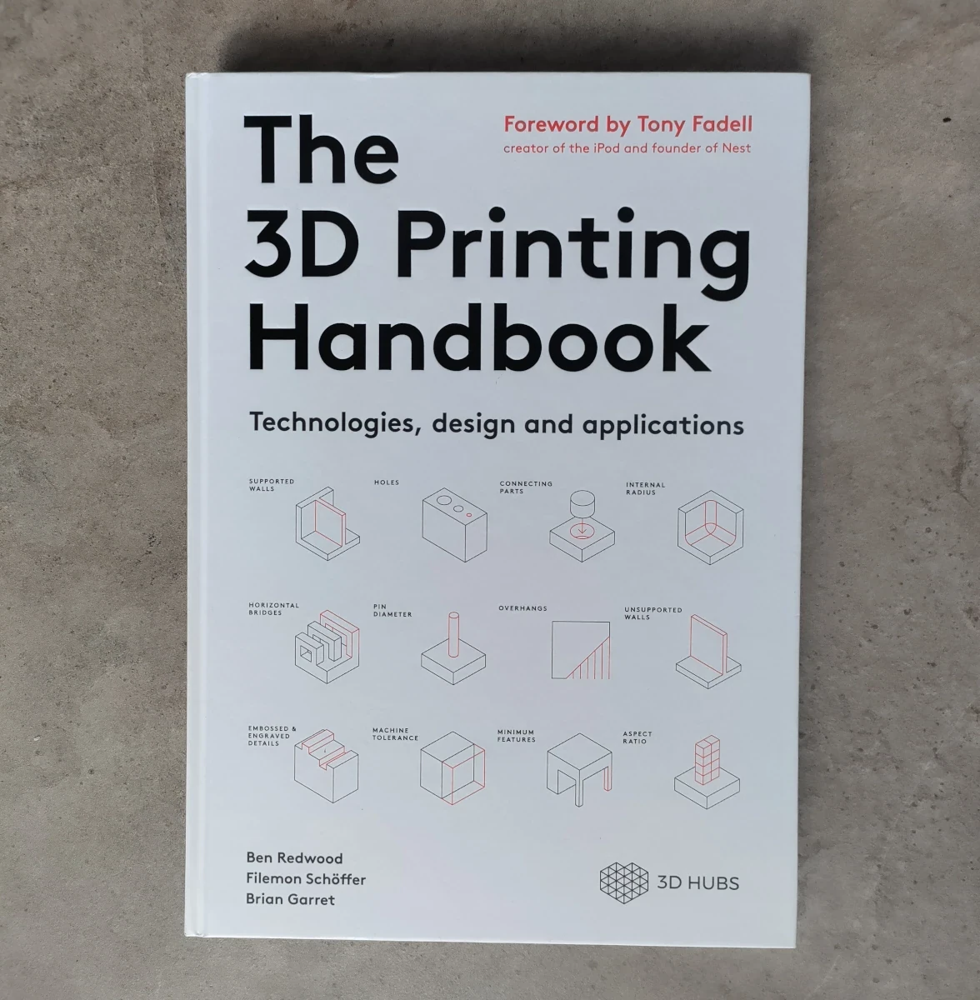
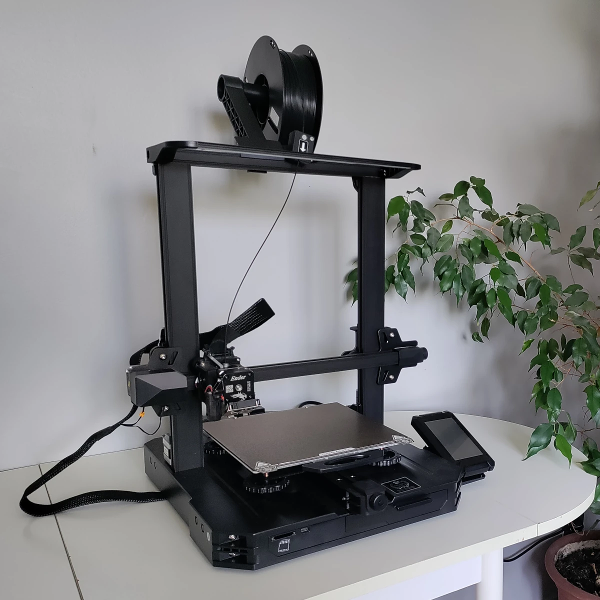
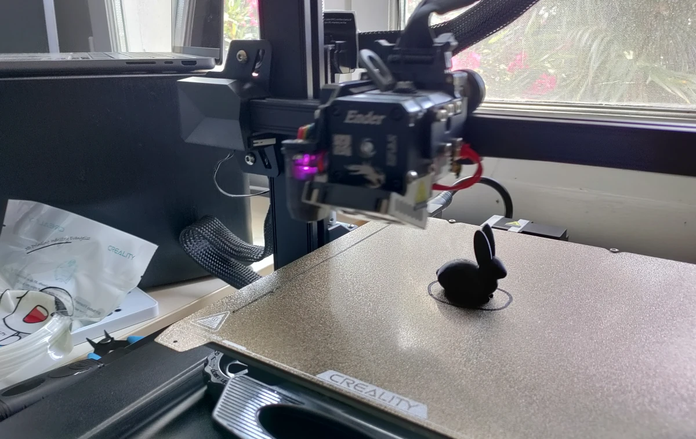
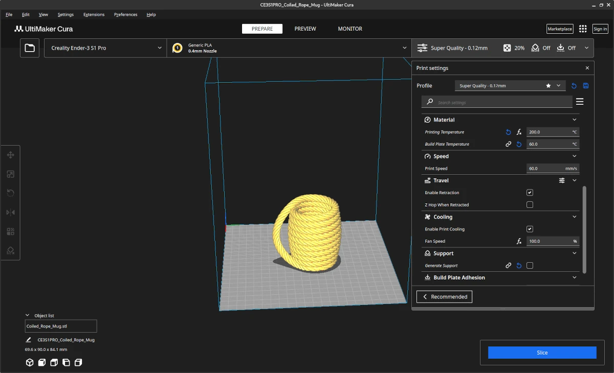

+++
author = "David Calvert"
title = "Entering the world of additive manufacturing"
date = "2023-08-23"
description = "I recently entered the world of additive manufacturing, more commonly known as 3D printing. In this article, I will explain what brought me there, and what were the steps required to be able to print things!"
tags = [
    "3D Printing"
]
categories = [
    "tech"
]
thumbnail = "/img/thumbs/yellow-pla.webp"
featureImage = "banner.webp"
featureImageAlt = 'A spool of yellow wire sitting on top of a machine by Osman Talha Dikyar on Unspash.'
+++

<!--more-->

## Introduction

I recently entered the world of additive manufacturing, more commonly known as 3D printing. In this article, I will explain what brought me there, and what were the steps required to be able to print things!

## Why

I have been interested in 3D printing for a long time, but never really got into the subject because I had no real need for it, and it was also quite expensive back then.
Last year, when attending Powder’s Christmas party, I was staying at [Tom](https://github.com/wheybags)’s place, who owns a [Creality Ender-3](https://www.creality.com/products/ender-3-3d-printer), and was amazed when he told me that you can now get a 3D printer for less than $200!

At that time, I also knew that I was going to start a new job at [Oqton](https://oqton.com/), a software company solving today’s manufacturing challenges by combining state-of-the-art AI, cloud, simulation, and the best in [CAD/CAM](https://en.wikipedia.org/wiki/CAD/CAM) technology for [additive production](https://oqton.com/additive/), and 3D scanning.

As I’m currently renovating my home, I quickly identified a few use-cases where it could help, but let’s be honest, it was just looking for an excuse to grab a 3D printer and start hacking with it!

## Getting started

When learning something completely new, I like to read at least one book on the topic I’m learning in order to get a baseline of theoretical knowledge. When I left Powder, I was offered a few technical books as a departure gift, this included [The 3D Printing Handbook](https://www.hubs.com/3d-printing-handbook/), a book that provides practical advice on selecting the right technology and how-to design for 3D printing. The book is concise, well written, and full of diagrams and pictures to illustrate the different types of manufacturing and 3D printing technologies. I highly recommend it to anyone who wants to learn more about manufacturing and, more specifically, additive manufacturing.

Because I knew from the beginning that a Fused Filament Fabrication (FFF) printer would best suited for my needs and budget, I started looking for my first 3D printer!

## Choosing a 3D printer

Before buying or doing anything, I like to invest time studying the market, and evaluating several options to be confident in the choices I make. I also keep track of these evaluations and the reasons that make me pick an option over another.

My goal was pretty simple, getting started with 3D printing without spending too much time and money. I was looking for the cheapest printer that would be beginner-friendly, hassle-free, evolutive and known enough to get help if needed.

With these criteria in mind, the [Creality Ender-3 V2](https://www.creality.com/products/ender-3-v2-3d-printer-csco) quickly seemed like the right fit for me. But after a few discussions with friends and colleagues at Oqton, I was told that it lacked automatic bed-leveling, which is a nice feature to have. You can of course upgrade any Ender printer with an automatic bed-leveling sensor, like the Creality BLTouch or the CRTouch, but I was looking for something simple.

I looked for a printer that would have an automatic bed-leveling sensor out of the box, and narrowed down my choice between the [Anycubic Kobra 2](https://www.anycubic.com/products/kobra-2) and the [Creality Ender-3 S1 Pro](https://www.creality.com/products/creality-ender-3-s1-pro-fdm-3d-printer).

The Kobra 2 is a brand-new model, and is way faster than the Ender-3 S1 Pro. I was a bit concerned by the fact that there was very little knowledge and usage history about this particular model. I also had some doubts on the ability to get spare parts from Anycubic, because they don’t seem to sell any on their website.

On the other end, the Ender-3 S1 Pro is the high-end version of the Ender-3 series, which includes most upgrades like the CR Touch, the lamp… The real advantage is that it can print up to 300°, which enable it to support more types of filaments: PLA, ABS, PVA, WOOD, TPU, PETG and PA, providing more manufacturing possibilities if needed in the future.

I finally decided to pick the Ender-3 S1 Pro, mostly for the fact that it supports more filaments, has a bigger community and that I can easily buy spare parts if anything goes wrong in the future. While printing speed is a huge advantage for the Kobra 2, it wasn’t a concern for me, as I don’t plan to print many things, and are generally quite patient.

## Printer assembly and calibration

While the Ender-3 S1 Pro is shipped as a kit, the assembly is pretty simple because 96% of the printer is already pre-assembled. The included guide is straightforward, and the printer can be assembled quickly without running into issues.

Once the printer was assembled, I loaded the black PLA+ filament that I ordered with the printer, powered the printer, and quickly looked at the printer’s settings using the touchscreen, then launched the automatic leveling program. Once done, I directly tried to print an object that was preloaded in the SD Card that came with the printer. Unfortunately, it started printing spaghetti's instead of the small rabbit… I cleaned the plate, re-launched the automatic leveling program and tried again, with the same result...

I was a bit disappointed, but I immediately started looking for a solution using my [favorite search engine](https://duckduckgo.com/), and noticed that several sources recommended doing a manual bed leveling for the very first time. I did it, followed by an automatic one, and it worked!

From there, I was finally able to do my very first print!

## Finding, Slicing, and Printing

With a working 3D printer at home, I started looking for things I could print, and there are plenty of websites where you can find some 3D models to buy or download for free. I’ve used [Thingiverse](https://www.thingiverse.com), [Printables by Josef Prusa](https://www.printables.com/) and [Pinshape](https://pinshape.com/), but there’s many more!

The downloaded files will generally be [STL](https://en.wikipedia.org/wiki/STL_(file_format)) files, a format created by 3D Systems in the 80s for [Stereolithography](https://en.wikipedia.org/wiki/Stereolithography), but has since became the standard file type for 3D printing.

In order to use STL files for 3D printing, you need to open them in a Slicer, a program that allows you to edit and prepare the object to be 3D printed. I’ve decided to pick [Ultimaker Cura](https://ultimaker.com/software/ultimaker-cura/), because it is a popular, and beginner-friendly option.

With Cura, I easily prepared my objects to be 3D printed following my preferences, like position on the bed, scale it, shrink it, add supports, change the nozzle’s temperature to fit my filaments…

Once my items were ready to print, I just clicked on “Slice” to convert them into G-code (Geometry code), an instruction format compatible with 3D printers. It contains the position of the printer's nozzle, the heat of the bed and the extruder, the speed of the printer, and everything else needed by your printer to successfully print the object. The output file is what’s needed by the printer to create the part.

Here are a few objects that I printed to make some tests :

")

## Final words

Being able to print objects at home is something that I find amazing! It will definitely help me do prototypes, and solve a few problems that I will encounter during my house renovation. It’s a great tool to have!

I now feel comfortable with the basics, but there are so many things left to discover, like object duplication using [LiDAR](https://en.wikipedia.org/wiki/Lidar) scanning, getting started with 3D modelling using CAD, try [OctoPrint](https://octoprint.org/) and much more!

Feel free to follow me on:

- GitHub : [https://github.com/dotdc](https://github.com/dotdc)
- Mastodon : [https://hachyderm.io/@0xDC](https://hachyderm.io/@0xDC)
- Twitter : [https://twitter.com/0xDC_](https://twitter.com/0xDC_)
- LinkedIn : [https://www.linkedin.com/in/0xDC](https://www.linkedin.com/in/0xDC)

👋
