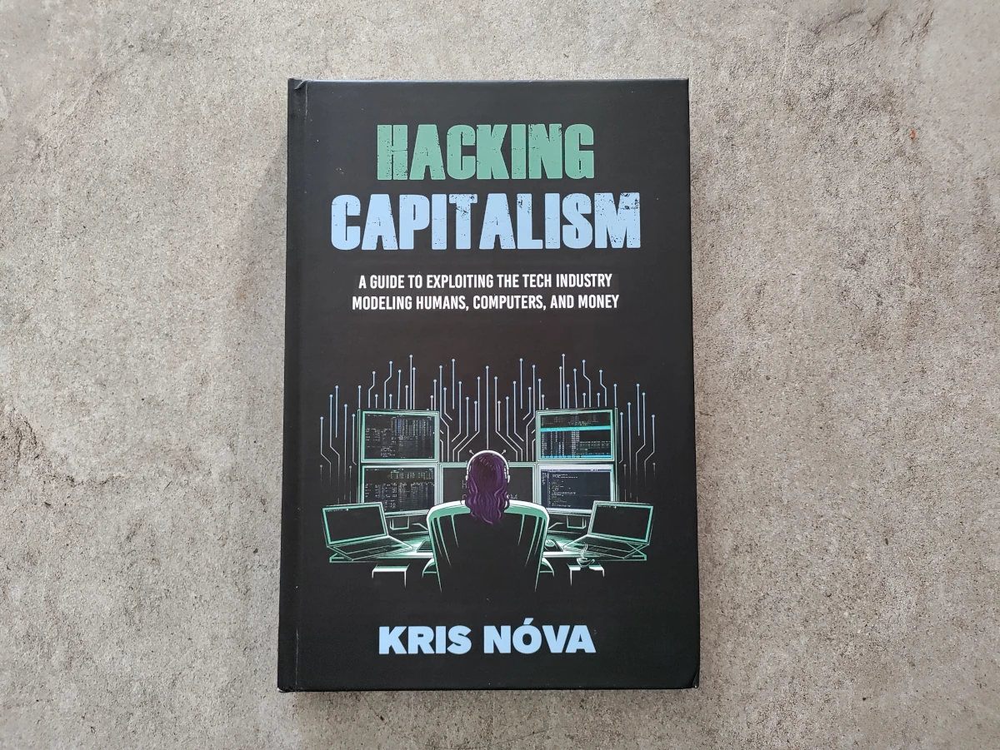
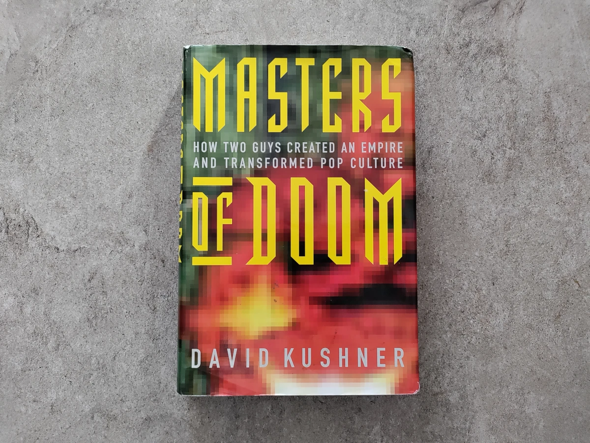
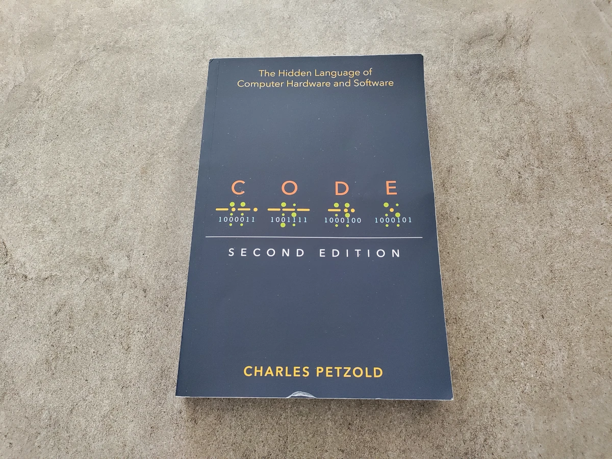
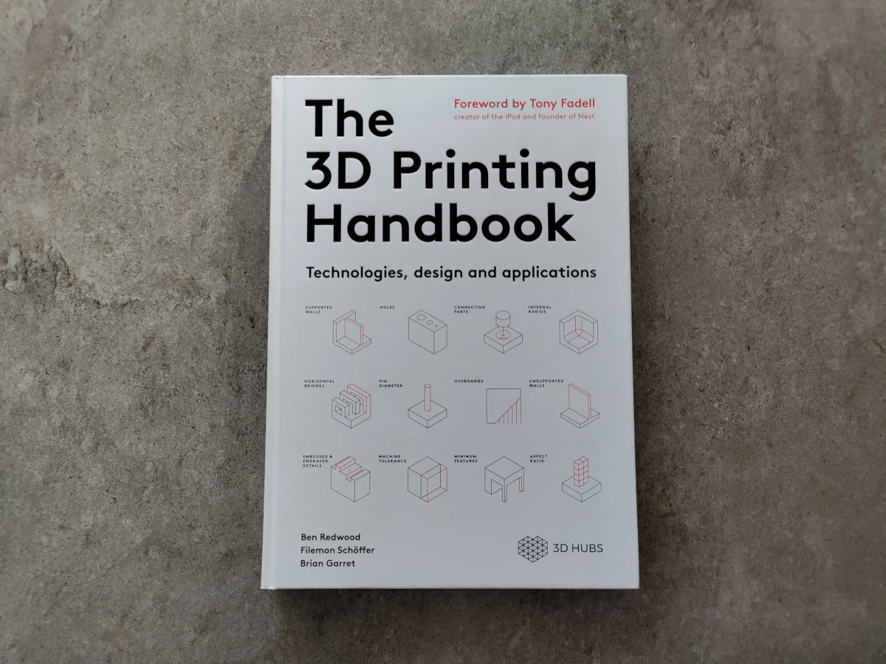
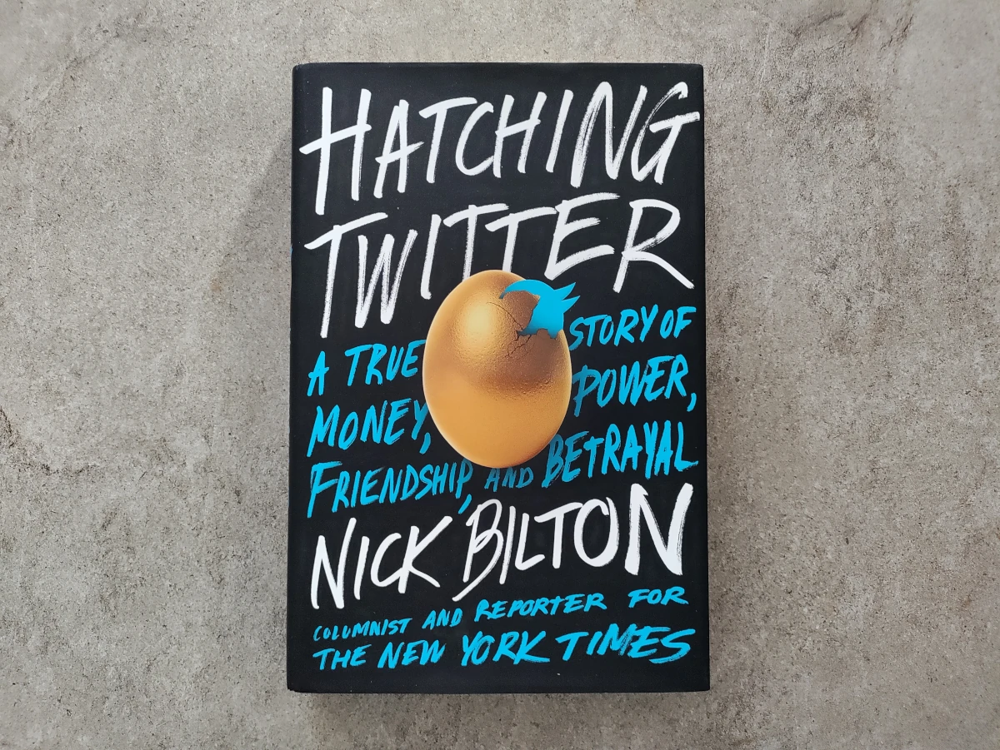
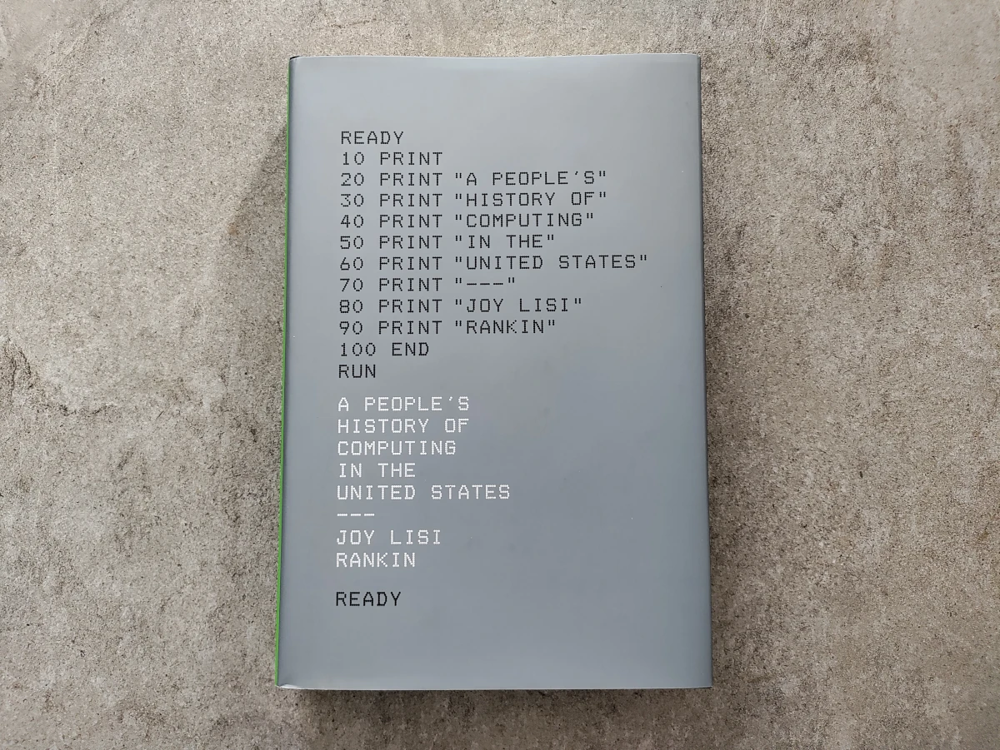

+++
author = "David Calvert"
title = "Favorite books on my 2023 reading list"
date = "2024-01-18"
description = "In this article, I'll share my favorite books related to tech that I read in 2023."
tags = [
    "culture"
]
categories = [
    "books"
]
thumbnail = "/img/thumbs/books.webp"
featureImage = "shelf.webp"
featureImageAlt = 'A picture of books on my shelf.'
+++

<!--more-->

In this article, I'll share my favorite books related to tech that I read in 2023.

## Hacking Capitalism

Author : [Kris Nóva](https://hachyderm.io/@nova)

I've finished reading Hacking Capitalism just before FOSDEM'23, where I had the chance to meet Kris, and discuss with her about the book and [Aurae](https://github.com/aurae-runtime/aurae). Unfortunately, she passed away on August, 16, 2023, during a climbing accident. My sincerest condolences to her friends and family.

Hacking Capitalism is a book on her experience within the tech industry. Among many things, she speaks about collaboration, competition, money, and influence across this industry. The content and style of the book is quite unique, and I guess it reflects some of who she was.

While anyone can get something from the book, it was written to give a set of tools to anyone who feels marginalized in tech. The tone is often negative, but aims to give a realistic vision for the newer generation, like how rivalry in tech companies can become as bad as it is in Game of Thrones.

Favorite quote :

> "If you feel marginalized, you are."
> p.14

## Masters of Doom

Author : [David Kushner](https://twitter.com/davidkushner)

If you grew up playing Apogee games and id Software games like I did, I highly recommend this book! It covers how [John Carmack](https://twitter.com/ID_AA_Carmack) and [John Romero](https://twitter.com/romero) created the games, founded id Software, and how they disrupted the gaming industry and society doing so!

The book is full of epic stories and anecdotes like :

- when [Ken Williams](https://twitter.com/caboken) offered them 2.5millions to buy id Software!
- how they bought a Pac-Man machine for $150 from the driver of their moving truck!
- when Romero found the Easter egg of himself on a spike!
- how they crashed the University of Wisconsin's computer network when they uploaded Doom's shareware!

It was such a pleasure to discover the story behind some of my childhood games, especially "COMMANDER KEEN--defender of Earth!" <3

I've also grabbed a copy of "Doom Guy" from John Romero, I'll probably read it in 2024!

Favorite quote:

> "Though Romero was somewhat supportive at first, Carmack had other ideas. 'Story in a game,' he said, 'is like story in a porn movie; it's expected to be there, but it's not that important.'"
> p.126

## Open Circuits

Authors : [Eric Schlaepfer](https://twitter.com/TubeTimeUS) and [Windell H. Oskay](https://twitter.com/EMSL)

"The inner beauty of electronic components"

This book is a tribute to the beauty of electronic components! The book is half informational, half art, but what really stands out, is the beautiful images! I love the fact that they shared how they prepared, cleaned, mounted, photographed and retouched the components to get this outstanding result!

Favorite quote :

> "Many electronic components were harmed in the making of this book!"
> p.271

## Code, Second Edition

Author : [Charles Petzold](https://www.charlespetzold.com)

"The Hidden language of Computer Hardware and Software"

I read this book because I wanted to get a deeper understanding of how these things works. The book covers many topics around computers and code: logic with switches, memory, braille code, telegraphs, relays and gates, base-ten, Hexadecimal, ASCII, Unicode…

I especially enjoyed the chapter "Bit by Bit by Bit" which explains how Universal Product Code (UPC) and QR codes works, alongside the explanation behind the 'Dare mighty things' secret message in the Mars rover's parachute.

This book, with its [codehiddenlanguage.com](https://codehiddenlanguage.com/) companion website, definitely helped me understand some concepts, and I recommend it to anyone who wants to have a more in-depth understanding of how computers works.

## The 3D Printing Handbook

Authors : [Ben Redwood](https://twitter.com/b_redwood), [Filemon Schöffer](https://twitter.com/filemonschoffer) and [Brian Garret](https://twitter.com/briangarret)

I've already talked about this book in my article: [Entering the world of additive manufacturing](https://0xdc.me/blog/entering-the-world-of-additive-manufacturing/), and I think it's a great introduction to additive manufacturing.

From the article :

> "This book provides practical advice on selecting the right technology and how-to design for 3D printing. The book is concise, well written, and full of diagrams and pictures to illustrate the different types of manufacturing and 3D printing technologies. I highly recommend it to anyone who wants to learn more about manufacturing and, more specifically, additive manufacturing."

## Hatching Twitter

Author : [Nick Bilton](https://twitter.com/nickbilton)

"A true story of money, power, friendship, and betrayal"

I decided it was a good time to read this book that has been sitting on my shelf for a while after the 2022 Twitter incident. The book begins with the background of the co-founders: [Evan Williams](https://twitter.com/ev), [Noah Glass](https://twitter.com/noah), [Jack Dorsey](https://twitter.com/jack) and [Biz Stone](https://twitter.com/biz), and how they met each others. Following that, you will learn more about the history of Twitter, which is undoubtedly "A true story of money, power, friendship, and betrayal"!

I've particularly enjoyed the fun facts, like the origins of hashtags on Twitter, or when Noah Glass consider "Twitch" for Twitter's name, before thinking that it would never work. Of course, it's only funny because the name was later adopted by a famous live-streaming platform :) Some are totally crazy, like when Snoop Dog stops by Twitter's offices!

I recommend this book to anyone who's considering starting a start-up, or any kind of business with friends, and to anyone who is eager to learn more about the history of Twitter, of course.

Favorite quote (while trying to coin the name) :

> "His vibrating phone led him to think of the brain impulses that cause a muscle to twitch. 'Twitch!' No, that would never work, he thought."
> p.61

## A people's history of computing in the United States

Author : [Joy Lisi Rankin](https://twitter.com/JoyMLRankin)

Reading this book feels like discovering lost chapters of computing history. From the creation of the [Dartmouth Time-Sharing System](https://en.wikipedia.org/wiki/Dartmouth_Time_Sharing_System) and the [BASIC](https://en.wikipedia.org/wiki/BASIC) programming language by [Kemeny](https://en.wikipedia.org/wiki/John_G._Kemeny) and [Kurtz](https://en.wikipedia.org/wiki/Thomas_E._Kurtz), to the network usage of the [PLATO](https://en.wikipedia.org/wiki/PLATO_(computer_system)) system, this book highlight the incredible stories of the computing citizens from the 60s and 70s.

There's a huge amount of historical information in this book, and the bibliography and notes at the end really reflect the amount of work and research that has been required to make this book. Kudos to the author!

Favorite quote :

> "There is a historical comparison between 'computer power' today, and 'electrical power' some thirty years ago. Federal funds gave us light - now federal funds must give us knowledge."
> p.138

That's it, I hope you found this article useful!

Feel free to follow me on:

- GitHub : [https://github.com/dotdc](https://github.com/dotdc)
- LinkedIn : [https://www.linkedin.com/in/0xDC](https://www.linkedin.com/in/0xDC)
- Bluesky : [https://bsky.app/profile/0xdc.me](https://bsky.app/profile/0xdc.me)
- Twitter : [https://twitter.com/0xDC_](https://twitter.com/0xDC_)
- Mastodon : [https://hachyderm.io/@0xDC](https://hachyderm.io/@0xDC)

👋
