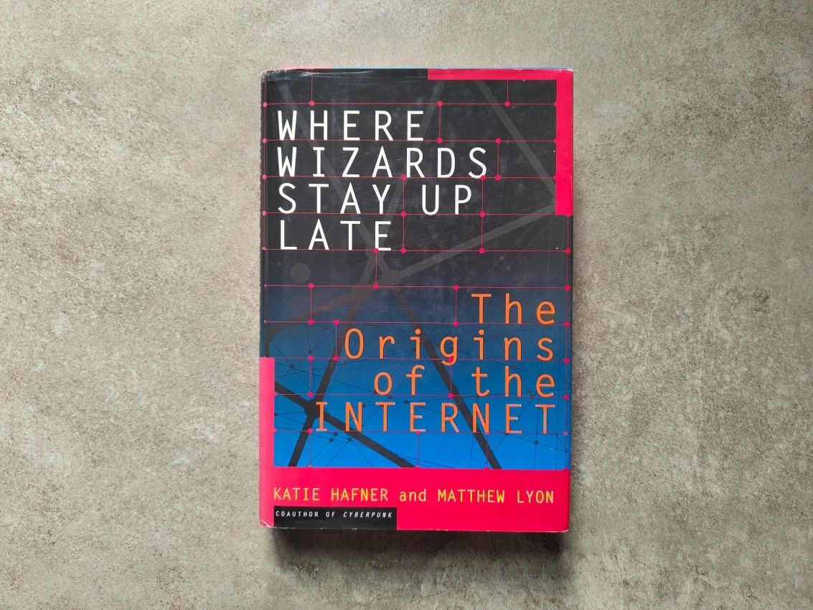
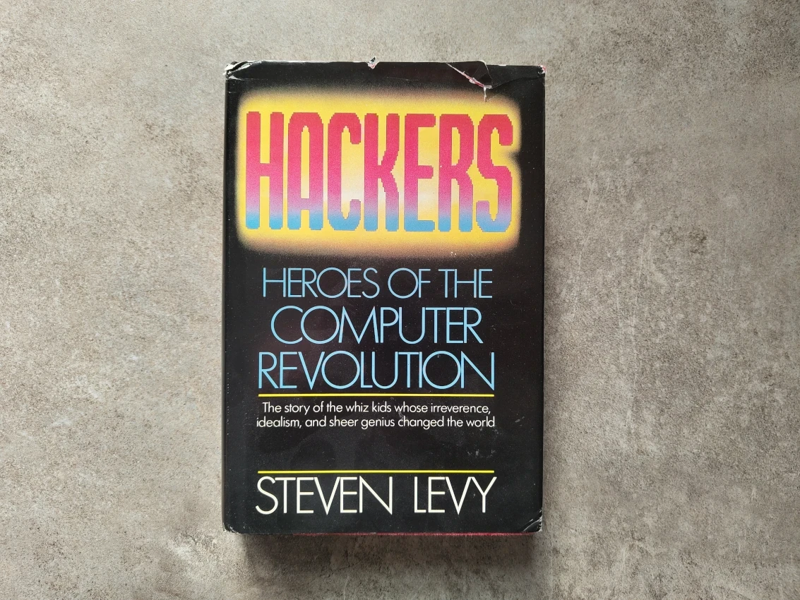

+++
author = "David Calvert"
title = "Favorite books on my 2024 reading list"
date = "2025-01-19"
description = "This article features my favorite tech or work-related reads from 2024."
tags = [
    "culture"
]
categories = [
    "books"
]
thumbnail = "/img/thumbs/books-2024.webp"
featureImage = "books.webp"
featureImageAlt = 'A picture of the books.'
+++

This article features my favorite tech or work-related reads from 2024.

## The Culture Map

Author: [Erin Meyer](https://x.com/erinmeyerinsead)\
Publish Date: May 27, 2014

I have been working with multicultural teams for the past few years, and I was curious to see how this book could improve my understanding of cultural differences and enhance my communication skills in such teams. I was happily surprised and learned a lot from the concepts described in the book!

The book defines and explores the following aspects of cultural differences:

- Communicating: low-context vs. high-context communication
- Evaluating: direct negative feedback vs. indirect negative feedback
- Persuading: principles-first vs. applications-first approaches
- Leading: egalitarian vs. hierarchical leadership styles
- Deciding: consensual vs. top-down decision-making
- Trusting: task-based vs. relationship-based trust
- Disagreeing: confrontational vs. non-confrontational approaches
- Scheduling: linear-time vs. flexible-time approaches

I highly recommend this book to anyone seeking to improve their understanding of cultural differences and how they influence teamwork, communication and leadership.

Favorite Quote:

> "Speaking of cultural differences leads us to stereotype and therefore put individuals in boxes with 'general traits.' Instead of talking about culture, it is important to judge people as individuals, not just products of their environment."
> p.13

## Where Wizards Stay Up Late

Authors: [Katie Hafner](https://x.com/katiehafner) and Matthew Lyon\
Publish Date: January 21, 1998

The book is about the bold, visionary, and fascinating history of the creation of the internet! It covers the people, events, decisions and work which contributed to the development of what we now call the internet. It is full of details and amazing anecdotes, such as the creation of the Interface Message Processor (IMP), the first Request for Comments (RFC), the use of the "@" symbol in email addresses and much more!

I highly recommend it to anyone interested in the history of computing and the origins of the internet.

Favorite Quote:

> "I decided it was worth the risk to spend $25,000 on an unknown machine for an unknown purpose"
> p.84

## Géopolitique du numérique : l'impérialisme à pas de géants

Author: [Ophélie Coelho](https://www.linkedin.com/in/ophelie-coelho)\
Publish Date: January 21, 1998

The title of this book can be translated to "Geopolitics of the digital world: imperialism in giant leaps." The book explains how Big Tech has taken control of the digital world, building modern empires and managing critical internet infrastructure.

I like the analyses and insights provided by this book, especially around internet infrastructure like the submarine cable map and their owners. Although the book was published very recently, things are going so fast that it already lacks at least two chapters. For instance, Silicon Valley is changing, and the impact of generative AI is yet to come. Big Tech is also preparing for the future: [Microsoft is about to restart Three Mile Island](https://www.technologyreview.com/2024/09/26/1104516/three-mile-island-microsoft/), [Google is betting on small modular reactors](https://blog.google/outreach-initiatives/sustainability/google-kairos-power-nuclear-energy-agreement/) (SMR), and [Amazon is doing the same thing](https://heatmap.news/technology/amazon-x-energy-nuclear-deal).

I'm curious to see how things will evolve in the coming years!

Favorite Quote (translated):

> "In France, all the presidents of the Fifth Republic have faced this issue, each with their own technological mascot: De Gaulle and Pompidou with the giant computers of the 'Plan Calcul', Giscard d'Estaing with the [Minitel](https://en.wikipedia.org/wiki/Minitel), Mitterrand with computing in schools, Chirac with broadband, Sarkozy with the iPad, Hollande with the 'Grande École du Numérique,' and Macron with the 'Start-up Nation'. Most of these initiatives ended in failures that were more or less significant."
> p.126

## Chevaliers d'Internet et pirates informatiques

Authors: Yoann Vandoorselaere, [Philippe Langlois](https://www.linkedin.com/in/langlois), Alexandre Golovanivsky\
Publish Date: March 23, 1999

I came across this book while visiting [Texplained](https://www.texplained.com) offices, and was curious enough to pick up a copy. The book title can be translated to "Knights of the Internet and computer hackers", it covers the authors' stories, sharing their passion, motivations and reflections on their hacking activities. Throughout the book, you'll read about [World-NET](https://en.wikipedia.org/wiki/World-NET), the [2600: The Hacker Quarterly](https://www.2600.com) meetings, the "[Free Kevin](https://en.wikipedia.org/wiki/Kevin_Mitnick)" movement and much more from that era!

Reading this book felt like traveling back in time.

Favorite Quote #1 (translated):

> "The elders know that the boundaries between good and evil are not as clear-cut as one might utopically believe in the beginning."
> p.154

Favorite Quote #2 (translated):

> "To "set an example", the two malicious students spent seven days in prison for "theft of electrical energy and machine time"!!"
> p.159

## Hackers: Heroes of the Computer Revolution

Author: [Steven Levy](https://x.com/StevenLevy)\
Publish Date: 1984

It felt very special to finally read this book, which had been on my family’s bookshelf throughout my childhood. It covers the rise of hackers, programmers and hardware engineers who shaped computing culture and technology from the 1950s to the 1980s.

While the entire book is a delight, the "Game Hackers" section especially resonated with me. As an adventure game enthusiast and longtime [Sierra On-Line](https://en.wikipedia.org/wiki/Sierra_Entertainment) fan, reading the wild stories from the early days was absolutely mind-blowing! The industry was so different back then! Now, I’m thrilled to dive into the full story in [Not All Fairy Tales Have Happy Endings](https://kensbook.com)!

A must read!

Favorite Quote #1:

> "If you try a few times and give up, you'll never get there. But if you keep at it... There's a lot of problems in the world which can really be solved by applying two or three times the persistence that other people will."
> p.83

Favorite Quote #2:

> "The computer is a magic box. It's a tool. It's an art form. It's the ultimate martial art... There's no bullshit in there. Without truth, the computer won't work. You can't bullshit a computer, God damn it, the bit is there or the bit ain't there."
> p.184

Does any of these books resonate with you?

Feel free to follow me on:

- GitHub : [https://github.com/dotdc](https://github.com/dotdc)
- LinkedIn : [https://www.linkedin.com/in/0xDC](https://www.linkedin.com/in/0xDC)
- Bluesky : [https://bsky.app/profile/0xdc.me](https://bsky.app/profile/0xdc.me)
- Twitter : [https://twitter.com/0xDC_](https://twitter.com/0xDC_)
- Mastodon : [https://hachyderm.io/@0xDC](https://hachyderm.io/@0xDC)

👋
