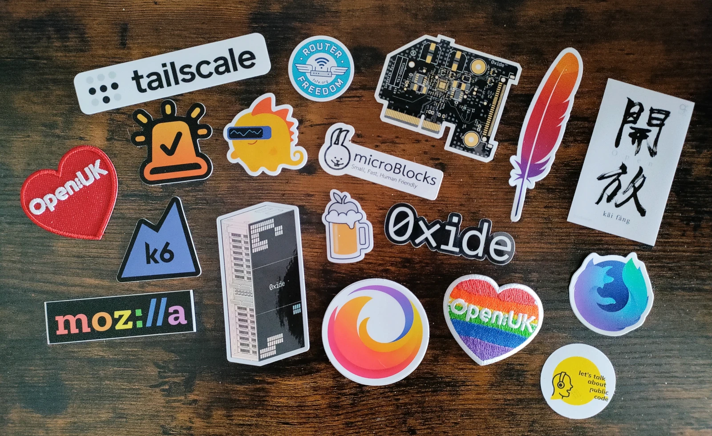

+++
author = "David Calvert"
title = "FOSDEM 2023 Highlights"
date = "2023-02-06"
description = "FOSDEM 2023 Highlights"
tags = [
    "fosdem", "conference"
]
categories = [
    "tech"
]
thumbnail = "/img/thumbs/fosdem.webp"
featureImage = "fosdem.webp"
featureImageAlt = 'A picture taken at the ULB campus during FOSDEM 2023.'
+++

<!--more-->

> FOSDEM is a free event for software developers to meet, share ideas and collaborate. Every year, thousands of developers of free and open source software from all over the world gather at the event in Brussels. You don't need to register. Just turn up and join in!

## Introduction

I started to attend FOSDEM in 2016 with some former [Orange](https://www.orange.fr/portail) colleagues. Unfortunately, I didn’t have the opportunity to attend since the pandemic, but I'm really glad to be back in person for this 2023 edition! This year, I joined the event with my friend [Tom](https://github.com/wheybags) from [Powder](https://powder.gg/), and we started the weekend with a casual stop at the Delirium cafe Friday night!

## My schedule

After [Richard Hartmann](https://hachyderm.io/@RichiH@chaos.social)’s opening keynote Saturday morning, I made my regular tour of the stands and talked with folks from [OpenUK](https://openuk.uk/), [Open Toolchain](https://www.opentoolchain.org/), [Microblocks](http://microblocks.fun/), [Grafana](https://grafana.com/) and [Open Nebula](https://opennebula.io/). Of course, I also took the time to spin the famous VLC wheel. Was surprised to see that O'Reilly’s stand and both the BSD and LPI certification exams were missing this year. What happened?

FOSDEM is always a good opportunity to discover new things and make new friends by talking with people from the open source community. This year I had the chance to talk with :

- [Andy Fiddaman](https://github.com/citrus-it) from the [Oxide computer company](https://oxide.computer/). It was unexpected, but pretty cool! Andy has been kind to discuss with us for a while about what they're actually up to at Oxide!
- [Kris Nova](https://hachyderm.io/@nova), mostly known for hosting the tech industry at [hachyderm.io](http://hachyderm.io/) since Musk bought the bird site. Was cool to ask her a few questions on [Aurae](https://github.com/aurae-runtime/aurae) and a potential WebAssembly support after the Aurae talk in the Rust developer room. She also took the time to sign my copy of “[Hacking Capitalism](https://hackingcapitalism.io/)”, thanks!
- [Pascal Chevrel](https://hachyderm.io/@pascalchevrel@mamot.fr), Staff Project Manager at Mozilla. We talked about Firefox, the engine, the competition, how funding is managed across the foundation and many other things!
- [Bartlomiej Plotka](https://github.com/bwplotka), Senior SWE at Google. It was planned to meet at FOSDEM, so he could sign the copy of “[Efficient Go](https://www.oreilly.com/library/view/efficient-go/9781098105709/)” for my friend [Donia](https://hachyderm.io/@doniacld). After he struggled with his canceled flight, we finally managed to meet Saturday afternoon in the Golang room. He made a such kind message for her, thanks!
- A few people from [Tailscale](https://tailscale.com/), was nice to talk with them about… Tailscale of course! Tom also gave them feedback and a potential balance adjustment for the free tier.
- [James Clark](https://www.linkedin.com/in/jameshclrk/), Quantum Software Engineer at [Zapata](https://www.zapatacomputing.com/). Nice discussion about quantum computing, what we do at Powder, and also a bunch of other things.
- [Jelte Fennema](https://github.com/JelteF) Senior Developer at Microsoft, working on PostgreSQL and Citus, a PostgreSQL extension that transforms Postgres into a distributed database.
- [Terin Stock](https://github.com/terinjokes), Site Reliability Engineer at [Cloudflare](https://www.cloudflare.com/). We discussed many subjects like old games, Speed-running records, the internet archive…
- Someone from [System76](https://system76.com/), just told him they should offer alternative keyboard layouts on their laptops. I'm probably against the world here, but: QWERTY is not the only one!

I also grabbed a few stickers along the way!

## Talks

Here’s my bookmarked talks for this 2023 edition :

- [How regulating software for the European market could impact FOSS](https://fosdem.org/2023/schedule/event/cyber_resilience/)
- [Linux Inlaws: A how-to on world domination by accident](https://fosdem.org/2023/schedule/event/linux_inlaws/)
- [Podcasting 2.0: it's all about Interoperability](https://fosdem.org/2023/schedule/event/podcasting20/)
- [Decentralized Social Media with Hachyderm](https://fosdem.org/2023/schedule/event/hachyderm/)
- [Can we do an open source chip design in 45 minutes?](https://fosdem.org/2023/schedule/event/open_source_chip_design/)
- [Reimplementing the Coreutils in a modern language (Rust)](https://fosdem.org/2023/schedule/event/rust_coreutils/)
- [Rust based Shim-Firmware for confidential container](https://fosdem.org/2023/schedule/event/cc_online_rust/)
- [Lightweight Kubernetes Operators with WebAssembly](https://fosdem.org/2023/schedule/event/container_kubernetes_operators_wasm/)
- [Bizarre and Unusual Uses of DNS](https://fosdem.org/2023/schedule/event/dns_bizarre_and_unusual_uses_of_dns/)
- [Headscale: How we are using integration testing to reimplement Tailscale](https://fosdem.org/2023/schedule/event/goheadscale/)
- [Rust in the Kernel (via eBPF)](https://fosdem.org/2023/schedule/event/rust_ebpf/)
- [Aurae: Distributed Runtime](https://fosdem.org/2023/schedule/event/rust_aurae_a_new_pid_1_for_distributed_systems/)
- [How to protect your Kubernetes cluster using Crowdsec](https://fosdem.org/2023/schedule/event/security_crowdsec/)

## Final words

Would like to thank Tailscale for their happy hour event and the free beers at the Brewdog bar Saturday night!

See you next year at FOSDEM’24 !

Feel free to follow me on:

- GitHub : [https://github.com/dotdc](https://github.com/dotdc)
- Mastodon : [https://hachyderm.io/@0xDC](https://hachyderm.io/@0xDC)
- Twitter : [https://twitter.com/0xDC_](https://twitter.com/0xDC_)
- LinkedIn : [https://www.linkedin.com/in/0xDC](https://www.linkedin.com/in/0xDC)

👋
