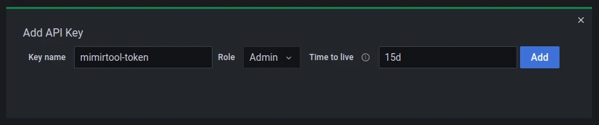

+++
author = "David Calvert"
title = "How to find unused Prometheus metrics using mimirtool"
date = "2023-04-03"
description = "In this article, I will explain how I used mimirtool to identify which metrics were used on the platform, and which wasn't."
tags = [
    "observability", "kubernetes", "monitoring"
]
categories = [
    "tech"
]
thumbnail = "/img/thumbs/prometheus.webp"
featureImage = "prometheus.webp"
featureImageAlt = 'Random numbers with the Prometheus logo in front.'
+++

<!--more-->

## Introduction

I recently had the task to stabilize, track cardinality issues, and significantly reduce resource usage of a Prometheus setup. In order to do that, I first needed to analyze the system. In this article, I will explain how I used `mimirtool` to identify which metrics were used on the platform, and which wasn't.

## Prerequisites

Everything described in this article has been done in a Kubernetes environment using [kube-prometheus-stack](https://github.com/prometheus-community/helm-charts/tree/main/charts/kube-prometheus-stack). You may need to adapt if your setup is different, but you should be good to go if you have at least one instance of both Prometheus and Grafana.

According to [Grafana's website](https://grafana.com/docs/mimir/latest/operators-guide/tools/mimirtool/):

> Mimirtool is a CLI tool that can be used for various operations on Prometheus compatible tasks that involve Grafana Mimir or Grafana Cloud Metrics.

To reproduce the examples, you will need:

- kubectl
- mimirtool
- jq

```bash
# Archlinux
pacman -Sy kubectl mimir jq

# MacOS
brew install kubectl mimirtool jq
```

If your Prometheus and Grafana instances are also running on Kubernetes, you can copy their pod names in the variables below if you want to be able to copy and paste the examples:

```bash
# kubectl get po -n monitoring | grep -E 'prometheus|grafana'
my_grafana_pod="kube-prometheus-stack-grafana-6b7fc54bd9-q2fdj"
my_prometheus_pod="prometheus-kube-prometheus-stack-prometheus-0"
```

## Analyze your Prometheus metrics usage

The first thing we need to do is to identify the metrics we use and the metrics we have. I’ve done this manually using `grep` in the past, but `mimirtool` makes it really easy !

### Metrics in Grafana dashboards

Before we can extract the list of metrics used in our Grafana instance, we first need to create a Grafana API Key with the Admin role. If you have an exposed Grafana instance, just open it and go to [https://grafana.your.domain/org/apikeys](https://grafana.your.domain/org/apikeys).

If not, you may need to expose it before:

```bash
# Run this is a separate terminal
kubectl port-forward ${my_grafana_pod} -n monitoring 3000:3000
```

You should then be able to open: [http://localhost:3000/org/apikeys](http://localhost:3000/org/apikeys)

From there, click the `New API key` button, give the key a name, the `Admin` role and optionally, a TTL like below:



Click `Add` and save the token to a variable in your terminal:

```bash
GRAFANA_API_TOKEN="copy your token here"
```

We can now use `mimirtool` to extract the list of metrics used in our Grafana instance:

```bash
mimirtool analyze grafana --address=http://localhost:3000 --key="${GRAFANA_API_TOKEN}"
```

Once done, you should have a `metrics-in-grafana.json` file in your current directory containing the list of metrics used in Grafana in the JSON format.

### Metrics in Prometheus rules

We are going to do the same thing for the metrics we use in our Prometheus rules.

Because I use Prometheus Operator, my rules are coming from various places and format, mostly ServiceMonitors but not only. At the end, they all get loaded on the Prometheus instance itself, this is why we need to extract the metrics list directly on the Prometheus pod.

All the rules were located in `/etc/prometheus/rules/` in my Prometheus pod, check yours and adapt if needed:

```bash
# Print your Prometheus rules files
kubectl exec -it ${my_prometheus_pod} -n monitoring \
  -- sh -c 'for i in `find /etc/prometheus/rules/ -type f` ; do cat $i ; done'
```

If you see your Prometheus rules on the output, export them to a local file:

```bash
# Export your Prometheus rules files to a local file
kubectl exec -it ${my_prometheus_pod} -n monitoring \
  -- sh -c 'for i in `find /etc/prometheus/rules/ -type f` ; do cat $i ; done' > my-prom-rules.yaml
```

If you had several rule files, you may need to fix the YAML schema before going further:

```bash
# Fix the combined rules YAML schema for mimirtool
sed -i -e 's/groups://g' -e '1s/^/groups:/' my-prom-rules.yaml
```

You can also do this in a single command:

```bash
# One-liner
kubectl exec -it ${my_prometheus_pod} -n monitoring \
  -- sh -c 'for i in `find /etc/prometheus/rules/ -type f` ; do cat $i ; done' \
  | sed -e 's/groups://g' -e '1s/^/groups:/' > my-prom-rules.yaml
```

Now that we have our exported rules in `my-prom-rules.yaml`, we can now use `mimirtool` to extract the list of metrics :

```bash
mimirtool analyze rule-file my-prom-rules.yaml
```

Similarly to what we had for Grafana, you should now have a `metrics-in-ruler.json` file in your current directory containing the list of metrics used in your Prometheus rules.

### Metrics elsewhere

Depending on your environment, you might use Prometheus metrics elsewhere, for example, if you have any HorizontalPodAutoscaler based on custom metrics. If that is the case, you will need to find a way to import the list of metrics in one of these files before going further.

### Compare with Prometheus

Once we have both `metrics-in-grafana.json` and `metrics-in-ruler.json`, which contains the list of metrics we currently use, we can compare them with all the metrics we have in Prometheus. This allows us to get the list of used and unused metrics of our setup.

To do so, we need to expose our Prometheus instance:

```bash
# run this is a separate terminal
kubectl port-forward ${my_prometheus_pod} -n monitoring 9090:9090
```

Once again, we are going to use `mimirtool` that will automatically load the files we created previously and compare them with the metrics stored in our Prometheus instance:

```bash
mimirtool analyze prometheus --address=http://localhost:9090
```

Example output:

```bash
$ mimirtool analyze prometheus --address=http://localhost:9090
INFO[0000] Found 1377 metric names
INFO[0000] 22451 active series are being used in dashboards
INFO[0000] 28440 active series are NOT being used in dashboards
INFO[0000] 270 in use active series metric count
INFO[0000] 1105 not in use active series metric count
```

You should end up with the file `prometheus-metrics.json`, containing the list of used and unused metrics.

To save the list of used metrics in raw text:

```bash
jq -r ".in_use_metric_counts[].metric" prometheus-metrics.json | sort > used_metrics.txt
```

To save the list of unused metrics in raw text:

```bash
jq -r ".additional_metric_counts[].metric" prometheus-metrics.json | sort > unused_metrics.txt
```

In this example, which is a default Kubernetes deployment with only a few running applications, we see that only 270/1377 metrics are used, this means that 80% of the scraped metrics are never used! The more applications and metrics you have, the more likely this number will be higher.

The unused list is probably the most interesting one. With it, we can identify useful metrics that we could exploit in our dashboards and alerts, but also, useless ones that we should disable from the exporter when it's possible, or drop them using [relabeling rules](https://grafana.com/blog/2022/03/21/how-relabeling-in-prometheus-works/).

## Final words

In this article, we were able to extract the list of used and unused metrics from our Prometheus instance. While this is useful to understand our setup, keep in mind that disabling and dropping unused metrics may have a limited impact on Prometheus performance. In a further article, I will explain how I dealt with cardinality issues and significantly reduce Prometheus resource usage.

Feel free to follow me on:

- GitHub : [https://github.com/dotdc](https://github.com/dotdc)
- LinkedIn : [https://www.linkedin.com/in/0xDC](https://www.linkedin.com/in/0xDC)
- Bluesky : [https://bsky.app/profile/0xdc.me](https://bsky.app/profile/0xdc.me)
- Twitter : [https://twitter.com/0xDC_](https://twitter.com/0xDC_)
- Mastodon : [https://hachyderm.io/@0xDC](https://hachyderm.io/@0xDC)

👋
