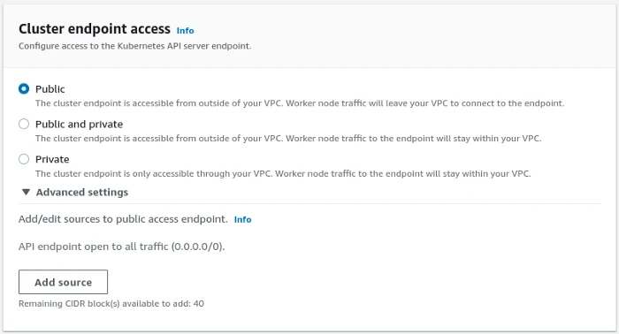
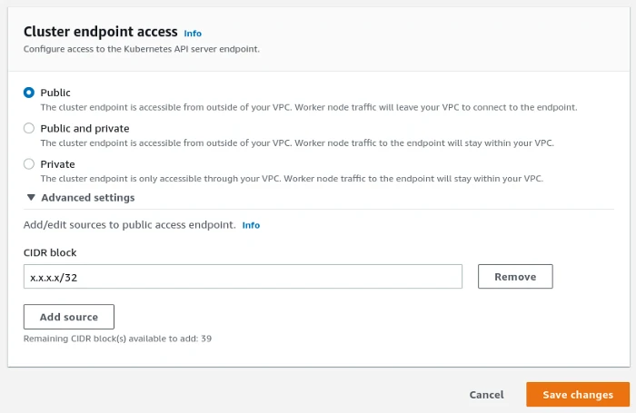
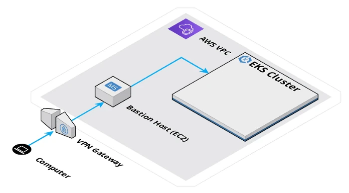

+++
author = "David Calvert"
title = "Is your Kubernetes API Server exposed?"
date = "2022-07-06"
description = "Is your Kubernetes API Server exposed?"
tags = [
    "security", "kubernetes", "aws"
]
categories = [
    "tech"
]
canonicalUrl = "https://medium.com/@dotdc/is-your-kubernetes-api-server-exposed-learn-how-to-check-and-fix-609ab9638fae"
thumbnail = "/img/thumbs/k8s-security.webp"
featureImage = "k8s-security-banner.webp"
featureImageAlt = "Picture from Tumisu on pixabay"
+++

> This article was originally published on [Medium](https://medium.com/@dotdc/is-your-kubernetes-api-server-exposed-learn-how-to-check-and-fix-609ab9638fae).

After reading “[Over 380 000 open Kubernetes API servers](https://www.shadowserver.org/news/over-380-000-open-kubernetes-api-servers/)”, I asked myself if some of the clusters I manage could be exposed. I then decided to check and I think you should too!

<!--more-->

## What are we talking about?

If you work with Kubernetes, there is a good chance that most of your interaction with it is thru the Kubernetes API Server. Almost each time you use [kubectl](https://kubernetes.io/docs/reference/kubectl/kubectl/), [k9s](https://github.com/derailed/k9s), [Lens](https://github.com/lensapp/lens) or [Octant](https://github.com/vmware-tanzu/octant), you are in fact sending HTTP requests to the API Server.

What’s interesting here is to know:

- From where are you talking to the API?
- And what’s in between?

If you are using your Kubernetes client thru a [bastion host](https://en.wikipedia.org/wiki/Bastion_host) and/or a [virtual private network](https://en.wikipedia.org/wiki/Virtual_private_network) ([VPN](https://en.wikipedia.org/wiki/Virtual_private_network)), your are probably in a good spot. If not or in doubt, you should definitely check!

## Why would it be exposed?

There could be many different answers to this question, but the most common one is probably going to be: because it’s the default!

I’m going to use [Amazon Elastic Kubernetes Service](https://aws.amazon.com/eks/) ([EKS](https://aws.amazon.com/eks/)) as an example here. When you create an EKS cluster on AWS, here’s what you will find by default on Step 2 “Specify networking” :



This means that all clusters created using the default configuration expose the API Server to the entire internet (0.0.0.0/0)! A bit scary… but let’s not panic!

## How to test ?

In order to test your cluster configuration, you will need to get your Kubernetes cluster API Server(s) IP or FQDN. In most cases, you will find this information in your Kubernetes configuration file:

```
$ grep server ~/.kube/config
server:https://XXXXXXXXX.abc.us-west-1.eks.amazonaws.com
server:https://XXXXXXXXX.abc.us-west-1.eks.amazonaws.com
server:https://XXXXXXXXX.abc.us-west-1.eks.amazonaws.com
```

Once you have this, you can simply try to query the `/version` endpoint from your terminal or any web browser:

```
$ curl -k https://XXXXXXXXX.abc.us-west-1.eks.amazonaws.com/version
{
  "major": "1",
  "minor": "20+",
  "gitVersion": "v1.20.15-eks-a64ea69",
  "gitCommit": "03450cdabfc4162d4e447e6d8c5037efe6d29742",
  "gitTreeState": "clean",
  "buildDate": "2022-05-12T18:44:04Z",
  "goVersion": "go1.15.15",
  "compiler": "gc",
  "platform": "linux/amd64"
}
```

If you get similar answer, this means that you Kubernetes API Server is exposed on internet.

## How to fix it?

There’s many way to get around this, I will share here a quick way to reduce the attack surface easily and also a recommend a better architecture.

### The quick fix

This one is straightforward and you should be able to  it immediately in your AWS console.

- For a new cluster : EKS > Clusters > Create EKS cluster > Specify networking
- For an existing EKS cluster:*EKS > Clusters > ${Your-Cluster} > Networking Tab > Manage networking*

Once there, unfold *Advanced settings* and you will be able to add up to 40 source CIDR block. If you want to allow a single IP address, just append /32 after like this:



With this solution, your Kubernetes API server is still exposed publicly on internet, but only the configured CIDR block will be allowed to access it.

To get your public IP, you can use a service like [whatismyip.com](https://www.whatismyip.com/) or use dig:

```
$ dig +short myip.opendns.com@resolver1.opendns.com
x.x.x.x
```

### A better approach

Once you have limited your public exposition, you have time to think and work on a more secure and sophisticated architecture to manage your Kubernetes cluster(s).

I personally recommend to:

- Use a VPN to access your [Virtual Private Cloud](https://aws.amazon.com/vpc/) ([VPC](https://aws.amazon.com/vpc/))
- Configure your EKS Cluster endpoint access to *Private* mode
- Create a private SSH [bastion host](https://en.wikipedia.org/wiki/Bastion_host) in your VPC
- Update your EKS [Security Group](https://docs.aws.amazon.com/vpc/latest/userguide/VPC_SecurityGroups.html) to only allow inbound traffic from the bastion host
- Enable access & audit logs on your bastion

Here’s how the architecture looks like:



While this article used the AWS cloud provider, you should be able to reproduce something similar on most cloud providers.

## Final words

I hope that this article has been useful to you! If it’s the case, you should check out my other articles. Feel free to send me some feedback, especially if you find any errors, if you think of any enhancements or if you find something outstanding!

You can follow me on:

- GitHub : [https://github.com/dotdc](https://github.com/dotdc)
- Twitter : [https://twitter.com/0xDC_](https://twitter.com/0xDC_)
- LinkedIn : [https://www.linkedin.com/in/0xDC](https://www.linkedin.com/in/0xDC)

👋
