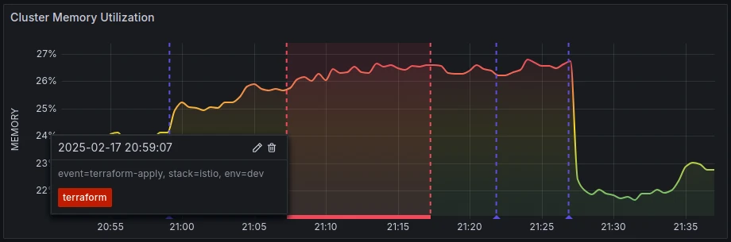
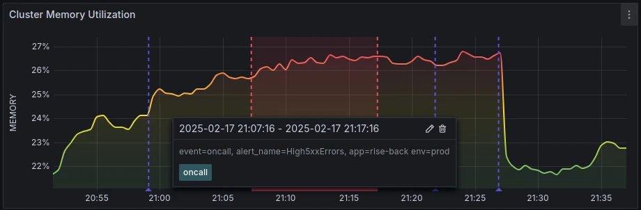
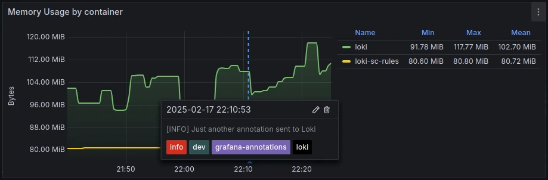

+++
author = "David Calvert"
title = "Leverage Grafana annotations"
date = "2025-02-18"
description = "Grafana annotations can help you and your team track key events like deployments, incidents, marketing campaigns or planned traffic spikes in your dashboards."
tags = [
    "observability", "monitoring", "grafana", "loki"
]
categories = [
    "tech"
]
thumbnail = "/img/thumbs/grafana-annotations.webp"
featureImage = "grafana-annotations-banner.webp"
featureImageAlt = 'A Grafana graph panel with Grafana annotations.'
+++

## Introduction

Grafana annotations can help you and your team track key events like deployments, incidents, marketing campaigns or planned traffic spikes in your dashboards.
In larger teams, not everyone knows what happened and when, annotations make it easy for SREs, QA engineers and developers to correlate graph data points with important events, which makes troubleshooting easier and faster.

## Prerequisites

You'll need a running Grafana instance with `Admin` privileges and a service account token with the `Editor` or `Admin` role.

To create a service account, go to: <https://grafana.domain.tld/org/serviceaccounts>

- Click on `Add service account`
- Give the service account a name (e.g. `annotations_sa`), and the `Editor` role.
- Create a token using the `Add service account token` button, then `Generate token`.

Save the token somewhere or export it on your terminal:

```bash
export GRAFANA_TOKEN=glsa_OlX64rUBFgWD0FpwyuZDtvgBGjqWNQQk_aed22945
```

For [logs annotations](#logs-annotations), you'll also need a running [Grafana Loki](https://github.com/grafana/loki) instance.

## What is an annotation?

> Annotations provide a way to mark points on a visualization with rich events. They are visualized as vertical lines and icons on all graph panels. When you hover over an annotation, you can get event description and event tags. The text field can include links to other systems with more detail.
>
> Source: [Grafana documentation - Annotate visualizations](https://grafana.com/docs/grafana/latest/dashboards/build-dashboards/annotate-visualizations/#add-an-annotation)

## Simple annotations

Every Grafana dashboard should have a [built-in query](https://grafana.com/docs/grafana/latest/dashboards/build-dashboards/annotate-visualizations/#built-in-query) for annotations.

Here's the default annotations field from Grafana's dashboard [JSON model](https://grafana.com/docs/grafana/latest/dashboards/build-dashboards/view-dashboard-json-model/):

```json
{
  "annotations": {
    "list": [
      {
        "builtIn": 1,
        "datasource": {
          "type": "grafana",
          "uid": "-- Grafana --"
        },
        "enable": true,
        "hide": true,
        "iconColor": "rgba(0, 211, 255, 1)",
        "name": "Annotations & Alerts",
        "type": "dashboard"
      }
    ]
  },
```

The Grafana documentation explain [how to manually add annotations to dashboards](https://grafana.com/docs/grafana/latest/dashboards/build-dashboards/annotate-visualizations/#add-an-annotation).\
It should work out-of-the-box, as soon as you have the `Editor` role.

## Custom annotations

Being able to annotate dashboards is nice, but you can also configure your Grafana dashboards to display annotations with custom tags.
If you manage dashboards, you can configure them to have extra annotations source.

For example, here's a JSON model with a custom `terraform` tag as an annotation source:

```json
{
  "annotations": {
    "list": [
      {
        // Removed for readability
      },
      {
        "datasource": {
          "type": "datasource",
          "uid": "grafana"
        },
        "enable": true,
        "hide": false,
        "iconColor": "#5c4ee5",
        "name": "terraform",
        "target": {
          "limit": 100,
          "matchAny": false,
          "tags": [
            "terraform"
          ],
          "type": "tags"
        }
      },
```

To create your own, open a Grafana dashboard, then click on: `Edit` > `Settings` > `Annotations` > `New query`.

On the form, make sure to select `-- Grafana --` as the data source, and to filter by `Tags`.\
Feel free to configure everything else to fit your needs.

If running on a Kubernetes cluster, expose the Grafana service on a terminal:

```bash
kubectl port-forward svc/kube-prometheus-stack-grafana -n monitoring 3000:80
```

Then send an annotation to Grafana using curl:

```bash
export GRAFANA_TOKEN="glsa_OlX64rUBFgWD0FpwyuZDtvgBGjqWNQQk_aed22945"

# Send an annotation to Grafana
curl -X POST http://localhost:3000/api/annotations \
  -H "Authorization: Bearer ${GRAFANA_TOKEN}" \
  -H "Content-Type: application/json" \
  -d '{
  "time": '$(date +%s%3N)',
  "tags": ["terraform"],
  "text": "event=terraform-apply, stack=istio, env=dev",
  "isRegion": false
}'
```

You should now see the custom annotation in your dashboard:


## Region annotations

Region annotations are similar, but they have a start time and end time to define a region.\
You can set the start time with `time` and the end time with `timeEnd`:

```bash
export GRAFANA_TOKEN="glsa_OlX64rUBFgWD0FpwyuZDtvgBGjqWNQQk_aed22945"

# Send a region annotation to Grafana
curl -X POST http://localhost:3000/api/annotations \
  -H "Authorization: Bearer ${GRAFANA_TOKEN}" \
  -H "Content-Type: application/json" \
  -d '{
  "time": '$(date +%s%3N -d "10 minutes ago")',
  "timeEnd": '$(date +%s%3N)',
  "tags": ["oncall"],
  "text": "event=oncall, alert_name=High5xxErrors, app=rise-back env=prod",
  "isRegion": true
}'
```

Here's how a region annotation should look like in your dashboard:


## Logs annotations

Instead of relying on internal Grafana annotations, you can also use another datasource to display annotations.\
We'll use Grafana Loki.

To do this, open a Grafana dashboard, then click on: `Edit` > `Settings` > `Annotations` > `New query`.\
On the form, make sure to select a working `Loki` data source and set a 'Query' for your annotation logs.\
We’ll use: `{job="grafana-annotations"}`.

Upon save, you should see the following in your dashboard JSON model:

```json
{
  "annotations": {
    "list": [
      {
        // Removed for readability
      },
      {
        "datasource": {
          "type": "loki",
          "uid": "P8E80F9AEF21F6940"
        },
        "enable": true,
        "expr": "{job=\"grafana-annotations\"}",
        "hide": false,
        "iconColor": "orange",
        "instant": false,
        "name": "Loki Annotations"
      }
    ]
```

Since UIDs are tied to a specific Grafana instance, it's recommended to create a dashboard variable instead.

To do so, open a Grafana dashboard, then click on: `Edit` > `Settings` > `Variables` > `New variable`.\
On the form, make sure you set 'Select variable type' to `Data source`, and data source 'Type' to `Loki`.

Upon save, you should see the following variable in your dashboard JSON model:

```json
{
  "templating": {
    "list": [
      {
        "current": {},
        "name": "datasource_loki",
        "options": [],
        "query": "loki",
        "refresh": 1,
        "regex": "",
        "type": "datasource"
      }
    ]
  },
```

You can then update the Loki `uid` field to use the `${datasource_loki}` variable in `annotations`:

```json
{
  "annotations": {
    "list": [
      {
        // Removed for readability
      },
      {
        "datasource": {
          "type": "loki",
          "uid": "${datasource_loki}"
        },
        "enable": true,
        "expr": "{job=\"grafana-annotations\"}",
        "hide": false,
        "iconColor": "orange",
        "instant": false,
        "name": "Loki Annotations"
      }
    ]
```

If running on a Kubernetes cluster, expose your Loki service on a terminal:

```bash
# Expose the Loki service if running on a Kubernetes cluster
kubectl port-forward svc/loki-gateway -n monitoring 3100:80
```

Then send an annotation log to Loki using curl:

```bash
# Send a log to Grafana Loki
curl -X POST http://localhost:3100/loki/api/v1/push \
  -H "Content-Type: application/json" \
  -d '{
    "streams": [
      {
        "stream": {
          "job": "grafana-annotations",
          "env": "dev",
          "stack": "loki"
        },
        "values": [
          ["'"$(date +%s%N)"'", "[INFO] Just another annotation sent to Loki"]
        ]
      }
    ]
  }'
```

You should now see the annotation from your Loki logs on your dashboard:


## Conclusion

Whether you're tracking deployments, incidents or other important events, Grafana annotations provide an efficient way to correlate events with dashboard data.
You can customize and automate annotations for events that matter to you, such as: pull request merges, Terraform apply operations or email campaign launches. Leveraging Grafana annotations will make troubleshooting on Grafana easier and faster!

Feel free to follow me on:

- GitHub : [https://github.com/dotdc](https://github.com/dotdc)
- LinkedIn : [https://www.linkedin.com/in/0xDC](https://www.linkedin.com/in/0xDC)
- Bluesky : [https://bsky.app/profile/0xdc.me](https://bsky.app/profile/0xdc.me)
- Twitter : [https://twitter.com/0xDC_](https://twitter.com/0xDC_)
- Mastodon : [https://hachyderm.io/@0xDC](https://hachyderm.io/@0xDC)

👋
