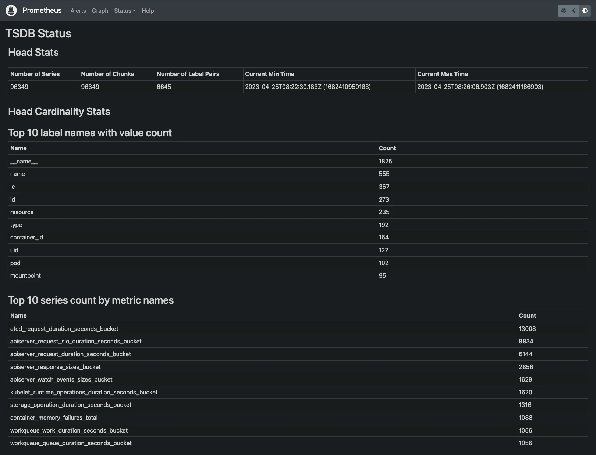
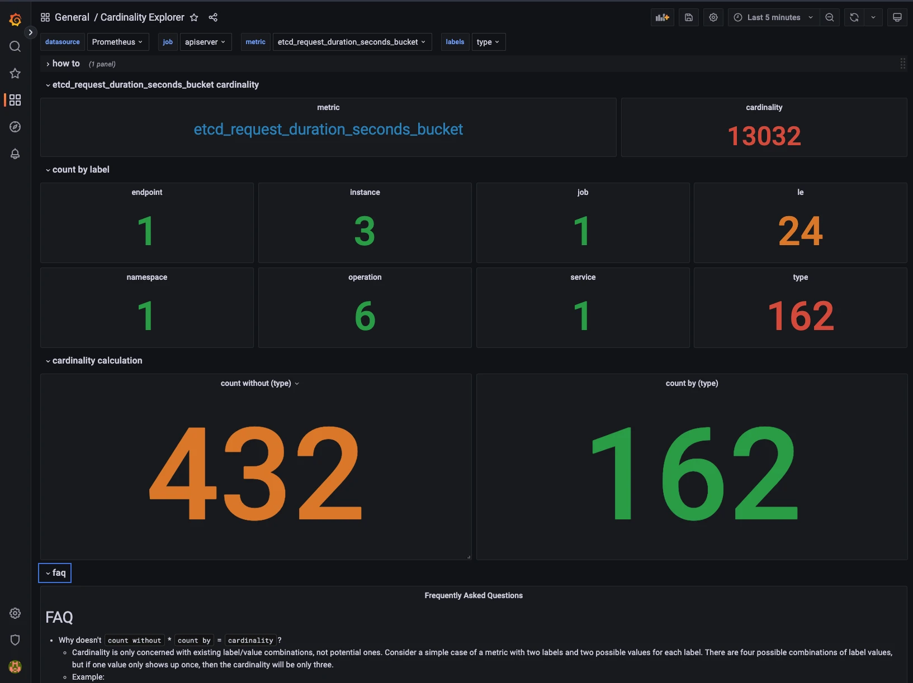
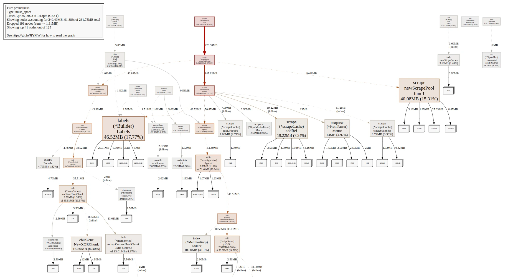
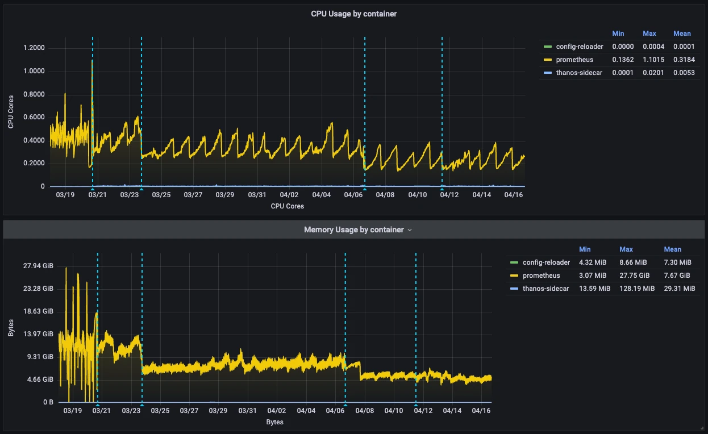

+++
author = "David Calvert"
title = "Prometheus’ performance and cardinality in practice"
date = "2023-04-25"
description = "In this article, I will explain how I analyzed and configured my Prometheus setup in order to significantly reduce its resource usage and worked around cardinality issues."
tags = [
    "observability", "kubernetes", "monitoring"
]
categories = [
    "tech"
]
canonicalUrl = "https://medium.com/@dotdc/prometheus-performance-and-cardinality-in-practice-74d5d9cd6230"
thumbnail = "/img/thumbs/prometheus.webp"
featureImage = "prometheus.webp"
featureImageAlt = 'Random numbers with the Prometheus logo in front.'
+++

<!--more-->

> This article was originally published on [Medium](https://medium.com/@dotdc/prometheus-performance-and-cardinality-in-practice-74d5d9cd6230).

In this article, I will explain how I analyzed and configured my Prometheus setup in order to significantly reduce its resource usage and worked around cardinality issues. This follows my previous article about Prometheus metrics analysis: [How to find unused Prometheus metrics using mimirtool](https://0xdc.me/blog/how-to-find-unused-prometheus-metrics-using-mimirtool/).

## Prerequisites

Everything described in this article has been done in a Kubernetes environment using [kube-prometheus-stack](https://github.com/prometheus-community/helm-charts/tree/main/charts/kube-prometheus-stack). You may need to adapt if your setup is different.

I also assume you have the list of your used and unused metrics, if it’s not the case, learn how to do that in my [previous article](https://0xdc.me/blog/how-to-find-unused-prometheus-metrics-using-mimirtool/). If you want to follow with sample data, you can use the [dotdc/prometheus-cardinality](https://github.com/dotdc/prometheus-cardinality) repository.

## Introduction

The Prometheus project tries to keep things as simple as they can be. It is also pretty open, and use-case specific features are generally offloaded to other projects like [Thanos](https://github.com/thanos-io/thanos), [Mimir](https://github.com/grafana/mimir) or [VictoriaMetrics](https://github.com/VictoriaMetrics/VictoriaMetrics). For this reason, there is no magic flag that will significantly change Prometheus' behavior. In order to improve the performance of your Prometheus setup, you will need to understand your usage and make the right design choice depending on your use-case and scale. Now that we know which metrics we use, and which we don’t, let’s see how we can configure our Prometheus setup.

## Dropping unused metrics

The most obvious thing that comes to mind is dropping the unused metrics.

Here are a few metrics from our unused list that we could drop:

```bash
node_arp_entries
node_netstat_Udp6_OutDatagrams
node_netstat_Udp6_RcvbufErrors
node_sockstat_FRAG6_inuse
node_sockstat_RAW6_inuse
node_softnet_dropped_total
node_softnet_processed_total
[...]
```

There are several ways to drop metrics, let’s explore the most common ones.

### Configuring the exporter

Configuring the source, here the [node_exporter](https://github.com/prometheus/node_exporter), should always be the preferred solution when it’s possible. Having the source configured properly, usually applications and exporters, will save a lot of time and resources because it doesn’t have to transit any further!

The first thing we can do is check at the source what option we have. In this case, the node_exporter has [collectors](https://github.com/prometheus/node_exporter#collectors) that be turned on and off.

```yaml
prometheus-node-exporter:
  # Doc: https://github.com/prometheus/node_exporter#collectors
  extraArgs:
    # Disable unused collectors
    - --no-collector.arp
    - --no-collector.ipvs
    - --no-collector.sockstat
    - --no-collector.softnet
    # Excludes from kube-prometheus-stack
    - --collector.filesystem.mount-points-exclude=^/(dev|proc|sys|var/lib/docker/.+|var/lib/kubelet/.+)($|/)
    - --collector.filesystem.fs-types-exclude=^(autofs|binfmt_misc|bpf|cgroup2?|configfs|debugfs|devpts|devtmpfs|fusectl|hugetlbfs|iso9660|mqueue|nsfs|overlay|proc|procfs|pstore|rpc_pipefs|securityfs|selinuxfs|squashfs|sysfs|tracefs)$
```

As you can see, we disabled the `arp`, `ipvs`, `sockstat` and `softnet` collectors. In case you don't want to drop the entire collector, a few of them can be configured to include or exclude certain patterns using dedicated flags.

Here's the list at the time of writing:

```bash
# Exclude flags
--collector.arp.device-exclude
--collector.diskstats.device-exclude
--collector.ethtool.device-exclude
--collector.filesystem.fs-types-exclude
--collector.filesystem.mount-points-exclude
--collector.netdev.device-exclude
--collector.qdisk.device-exclude
--collector.systemd.unit-exclude

# Include flags
--collector.arp.device-include
--collector.cpu.info.bugs-include
--collector.cpu.info.flags-include
--collector.diskstats.device-include
--collector.ethtool.metrics-include
--collector.netdev.device-include
--collector.qdisk.device-include
--collector.sysctl.include
--collector.systemd.unit-include
```

### Using relabeling rules

Now, let’s imagine that we want to drop only a few metrics from several collectors that don't have an exclude flag. Because we can’t do that through the exporter configuration, we need to make a relabeling rule to drop them. This rule will occur after scraping, but before ingestion.

Explaining how relabeling works is not in the scope of this article, but if you want to learn more, Grafana has an excellent article about that: [How relabeling in Prometheus works](https://grafana.com/blog/2022/03/21/how-relabeling-in-prometheus-works/).

Let’s imagine that we want to drop a few more unused metrics from our [unused node_exporter metrics](https://github.com/dotdc/prometheus-cardinality/blob/main/unused_metrics.txt#L977).

Here’s a rule that will drop a few of them:

```yaml
- sourceLabels: [__name__]
  action: drop
  regex: 'node_(nf_conntrack_stat|netstat_.*6|timex_pps|network_carrie|network_iface|scrape).*'
```

This rule need to be added to your Prometheus setup, in my case, I’m adding it to the node_exporter ServiceMonitor in my kube-prometheus-stack values.

Here’s the combined kube-prometheus-stack values for node-exporter metrics:

```yaml
# kube-prometheus-stack values for node-exporter metrics

prometheus-node-exporter:
  # Doc: https://github.com/prometheus/node_exporter#collectors
  extraArgs:
    # Disable unused collectors
    - --no-collector.arp
    - --no-collector.ipvs
    - --no-collector.sockstat
    - --no-collector.softnet
    # Excludes from kube-prometheus-stack
    - --collector.filesystem.mount-points-exclude=^/(dev|proc|sys|var/lib/docker/.+|var/lib/kubelet/.+)($|/)
    - --collector.filesystem.fs-types-exclude=^(autofs|binfmt_misc|bpf|cgroup2?|configfs|debugfs|devpts|devtmpfs|fusectl|hugetlbfs|iso9660|mqueue|nsfs|overlay|proc|procfs|pstore|rpc_pipefs|securityfs|selinuxfs|squashfs|sysfs|tracefs)$

  prometheus:
    monitor:
      enabled: true

      # MetricRelabelConfigs to apply to samples after scraping, but before ingestion.
      # Doc: https://github.com/prometheus-operator/prometheus-operator/blob/main/Documentation/api.md#relabelconfig
      metricRelabelings:
        # Unused node-exporter metrics
        - sourceLabels: [__name__]
          action: drop
          regex: 'node_(nf_conntrack_stat|netstat_.*6|timex_pps|network_carrie|network_iface|scrape).*'
```

## Tracking cardinality issues

You should now be able to disable metrics or drop them, depending on what suits best your use-case. Dropping every unused metric can be time-consuming and even counterproductive because the relabeling rules will consume a significant amount of resources on your Prometheus instance.

Instead of dropping everything, you should focus on metrics with the highest cardinality.

### Finding high-cardinality metrics

#### Using Prometheus UI

The Prometheus UI already has this information out of the box.

Let’s do a port-forward to expose our Prometheus instance locally:

```bash
# kubectl get po -n monitoring | grep prometheus
my_prometheus_pod="prometheus-kube-prometheus-stack-prometheus-0"

# port-forward
kubectl port-forward ${my_prometheus_pod} -n monitoring 9090:9090
```

Once done, you should be able to open [http://localhost:9090/tsdb-status](http://localhost:9090/tsdb-status) in your browser.



From there, you will have a bunch of useful stats to start your investigation:

- Top 10 label names with value count
- Top 10 series count by metric names
- Top 10 label names with high memory usage
- Top 10 series count by label value pairs

To start with, you should focus on the “Top 10 series count by metric names”. Note that you can also have this information by using [this PromQL query](http://localhost:9090/graph?g0.expr=topk(10%2C%20count%20by%20(__name__)(%7B__name__%3D~%22.%2B%22%7D))&g0.tab=1&g0.stacked=0&g0.show_exemplars=0&g0.range_input=1h). Feel free to adapt to see more metrics, example for the top 20:

```promql
topk(20, count by (__name__)({__name__=~".+"}))
```

Our top 10 looks like this:

| Name | Count |
|:--- |:--- |
| etcd_request_duration_seconds_bucket | 13008 |
| apiserver_request_slo_duration_seconds_bucket | 9834 |
| apiserver_request_duration_seconds_bucket | 6144 |
| apiserver_response_sizes_bucket | 2856 |
| apiserver_watch_events_sizes_bucket | 1629 |
| kubelet_runtime_operations_duration_seconds_bucket | 1620 |
| storage_operation_duration_seconds_bucket | 1316 |
| container_memory_failures_total | 1088 |
| workqueue_work_duration_seconds_bucket | 1056 |
| workqueue_queue_duration_seconds_bucket | 1056 |

Let’s compare the first one to our exported used and unused metrics lists:

```bash
$ grep etcd_request_duration_seconds_bucket u*_metrics.txt
unused_metrics.txt:etcd_request_duration_seconds_bucket
```

In this example, we can see that `etcd_request_duration_seconds_bucket`, our largest series, is not being used anywhere, so we can safely drop it. Whether these metrics are used or not, it is strongly recommended that you analyze them and decide whether to keep or drop them. This can have a significant impact on the performance of your Prometheus instance!

#### Using the Cardinality Explorer

Sometimes, you will have some high-cardinality metrics that you need to keep, but you will still need to find a solution for the cardinality issues. There is an excellent dashboard to find and understand the cardinality of Prometheus metrics, the [Cardinality Explorer dashboard](https://grafana.com/grafana/dashboards/11304-cardinality-explorer/).
You can import it using ID `11304` on Grafana.

The dashboard has `how-to` and `faq` sections that will help you understand and use this dashboard.

Let’s analyze the `etcd_request_duration_seconds_bucket` metric using the dashboard:



As we can see here, there are 162 different values for the `type` label. This metric has a cardinality of 13032, but would be only 432 without the `type` label.

As you can see, this dashboard shines at finding the dimensionality of labels in metrics. With this information, you can decide what is the best way to optimize, drop or empty a label, or even rework the metric itself. Keep in mind that dropping labels can create duplicate series, make sure that your metrics stays uniquely labelled after the drop.

## Going further

Once you found the good settings for your setup, you should notice a significant improvement in  performance and resource usage. Depending on your goals and scale, you might need to push it even further.

### Analyze resource usage with pprof

If you want to see and understand how Prometheus use its CPU and memory resources, pprof can probably give you a lot of additional information.

Once you have [pprof](https://github.com/google/pprof) and [graphviz](https://www.graphviz.org/download/) installed, you will be able to export this data in svg format:

```bash
# Export the cpu data
pprof -svg http://localhost:9090/debug/pprof/profile > pprof-prom-profile.svg
# Export the mem data
pprof -svg http://localhost:9090/debug/pprof/allocs > pprof-prom-allocs.svg
# Export the heap data
pprof -svg http://localhost:9090/debug/pprof/heap > pprof-prom-heap.svg
```

Example:


### Configure scrapeInterval

It’s always a good practice to configure the scrape_interval for each target or ServiceMonitor depending on your use-case. When you monitor infrastructure or applications performance, you often need a good resolution, but some use-cases don’t have this requirement, and they should be configured accordingly.

### Consider alternative solutions

Depending on your use-case and scale, and if it’s not already the case, you might want to consider using other Prometheus compatible solutions like [Thanos](https://github.com/thanos-io/thanos), [Mimir](https://github.com/grafana/mimir) or [VictoriaMetrics](https://github.com/VictoriaMetrics/VictoriaMetrics).

## Conclusion

The results you will get by doing this will highly depend on your starting point, environment, and the choices you make regarding metrics. To give you a real-world example, I did this at work and was able to reduce average CPU usage by up to 119% and average memory usage by up to 139% while increasing overall performance and stability.



If you plan to do this on your setup, you should focus your efforts towards high-cardinality metrics. I also recommend the [k8s-views-pods.json](https://github.com/dotdc/grafana-dashboards-kubernetes/blob/master/dashboards/k8s-views-pods.json) dashboard to track the resource usage of your Prometheus instances during the process.

**Useful tools:**

- [https://relabeler.promlabs.com/](https://relabeler.promlabs.com/)
- [https://grafana.com/grafana/dashboards/11304-cardinality-explorer/](https://grafana.com/grafana/dashboards/11304-cardinality-explorer/)

**Useful links:**

- [https://grafana.com/blog/2022/03/21/how-relabeling-in-prometheus-works/](https://grafana.com/blog/2022/03/21/how-relabeling-in-prometheus-works/)
- [https://grafana.com/docs/grafana-cloud/billing-and-usage/control-prometheus-metrics-usage/usage-reduction/](https://grafana.com/docs/grafana-cloud/billing-and-usage/control-prometheus-metrics-usage/usage-reduction/)
- [https://promlabs.com/blog/2022/12/15/understanding-duplicate-samples-and-out-of-order-timestamp-errors-in-prometheus/](https://promlabs.com/blog/2022/12/15/understanding-duplicate-samples-and-out-of-order-timestamp-errors-in-prometheus/)

## Final words

In this article, we learned how to significantly reduce resource usage and solve cardinality issues in our Prometheus setup. At scale, this can have a huge impact on performance and reduce the overall cost of your platform. I hope you found this article useful!

Feel free to follow me on:

- GitHub : [https://github.com/dotdc](https://github.com/dotdc)
- Mastodon : [https://hachyderm.io/@0xDC](https://hachyderm.io/@0xDC)
- Twitter : [https://twitter.com/0xDC_](https://twitter.com/0xDC_)
- LinkedIn : [https://www.linkedin.com/in/0xDC](https://www.linkedin.com/in/0xDC)

👋
