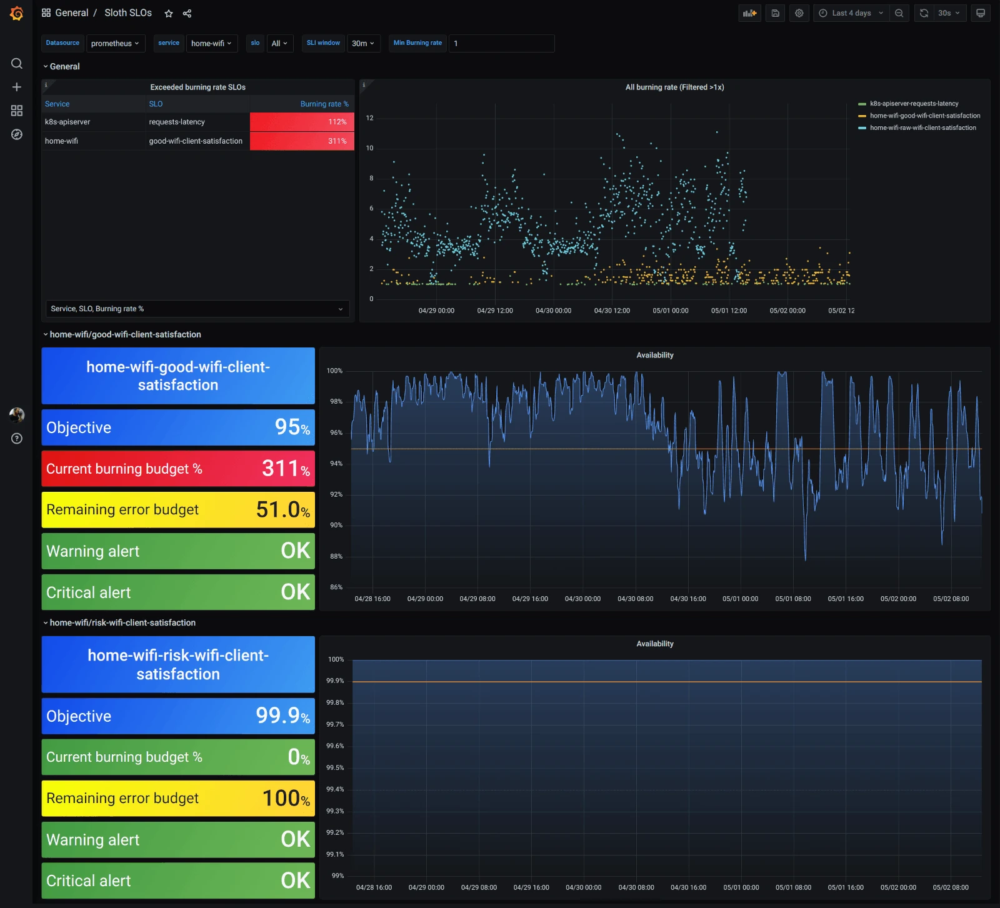
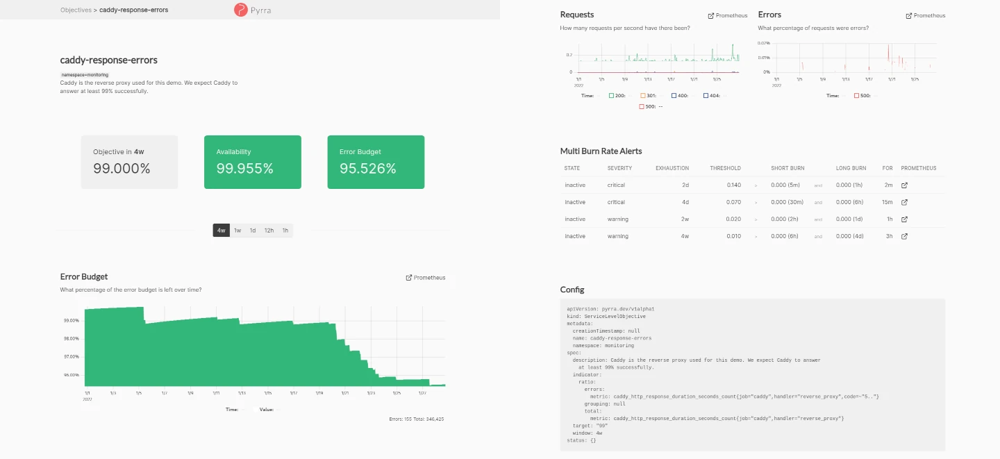
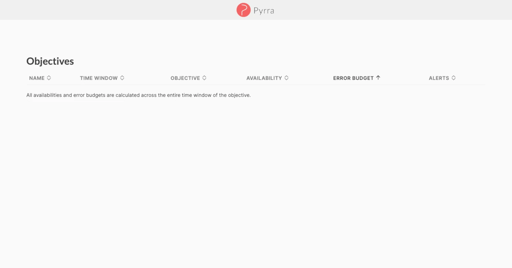

+++
author = "David Calvert"
title = "Service Level Objectives made easy with Sloth and Pyrra"
date = "2023-06-29"
description = "In this article, I will explain the main differences between Sloth and Pyrra, two projects that aims to help you create and manage Service Level Objectives."
tags = [
    "observability", "kubernetes", "sre", "monitoring"
]
categories = [
    "tech"
]
thumbnail = "/img/thumbs/slo-with-sloth-and-pyrra.webp"
featureImage = "sloth-and-pyrra-banner.webp"
featureImageAlt = 'Random numbers with the Prometheus logo in front.'
+++

<!--more-->

## Introduction

As part of a big refactoring of our Service Level Objectives (SLOs) implementation at work, I had the opportunity to try several tools and approaches to generate and manage SLOs. If you’re not familiar with the concept of SLOs, you should read the [Site Reliability Engineering Book](https://sre.google/sre-book/table-of-contents/) from Google, which is a must-read for everyone working on, or interested in DevOps, SRE and Platform Engineering.

A lot of things have changed since I first read the SRE book and implemented some of its concepts in early 2019. Back then, these concepts were new for most of us, and everything needed to be done manually. With the growing adoption of Site Reliability Engineering in the industry, projects like [OpenSLO](https://github.com/OpenSLO/OpenSLO), [Sloth](https://github.com/slok/sloth), [Pyrra](https://github.com/pyrra-dev/pyrra) and [Google SLO Generator](https://github.com/google/slo-generator) started to emerge to help define and manage SLOs.

Considering that most of our platforms are running on Kubernetes, Sloth and Pyrra quickly caught my attention, because both implement SLOs as a Kubernetes [Custom Resource Definition](https://kubernetes.io/docs/concepts/extend-kubernetes/api-extension/custom-resources/) (CRD).

Both projects share the same purpose and they have a lot in common:

- Easy SLOs generation
- Kubernetes SLO CRD
- [Prometheus](https://github.com/prometheus/prometheus) & [Prometheus-operator](https://github.com/prometheus-operator) compatibility
- [Multiwindow, Multi-Burn-Rate Alerts](https://landing.google.com/sre/workbook/chapters/alerting-on-slos/#6-multiwindow-multi-burn-rate-alerts)

## TL;DR

|  | Sloth | Pyrra | Best |
| --- | --- | --- | --- |
| GitHub Stars | 1656 | 890 | Sloth |
| Project activity | Last change 7 months ago | Last change 10 days ago | Pyrra |
| Web UI | No | Yes | Pyrra |
| SLO CRD | Yes | Yes | = |
| SLO Validation | Yes | No (will be added soon) | Sloth |
| SLO Group by label | No | Yes | Pyrra |
| Alerting  | Yes, slightly configurable | Yes, not configurable | Sloth |
| Grafana support | Yes | Yes (not compatible with grouping) | = |
| Plugins support  | Yes | No | Sloth |

## Sloth

Sloth is both a CLI and a Kubernetes operator built to generate and manage SLOs for Prometheus. It was created by Xabier Larrakoetxea Gallego ([GitHub](https://github.com/slok), [Twitter](https://twitter.com/slok69)) in April 2021.

In addition to being an SLO generator, Sloth has a few features that will help you even further with your SLO implementation. For example, the SLO validation feature will make sure that your SLOs are valid before the generation of the Prometheus rules. This can be really handy to track errors early, especially when SLOs are managed at various places or by several teams. This can even be done in a CI pipeline using [Sloth’s CLI](https://sloth.dev/usage/slo-validation).

The generation status can also be found on Sloth’s CRD output:

```bash
$ kubectl get prometheusservicelevels.sloth.slok.dev
NAME          SERVICE    DESIRED SLOS   READY SLOS   GEN OK   GEN AGE   AGE
broken-slo    my-svc     1              0            false              45s
working-slo   my-svc     1              1            true     45s       45s
```

Here’s how a `prometheusservicelevels.sloth.slok.dev` manifest looks like:

```yaml
apiVersion: sloth.slok.dev/v1
kind: PrometheusServiceLevel
metadata:
  name: sloth-slo-my-service
  namespace: monitoring
spec:
  service: "myservice"
  labels:
    owner: "myteam"
    repo: "myorg/myservice"
    tier: "2"
  slos:
    - name: "requests-availability"
      objective: 99.9
      description: "Common SLO based on availability for HTTP request responses."
      sli:
        events:
          errorQuery: sum(rate(http_requests_total{job="myservice",code=~"(5..|429)"}[{{.window}}]))
          totalQuery: sum(rate(http_requests_total{job="myservice"}[{{.window}}]))
      alerting:
        name: MyServiceHighErrorRate
        labels:
          category: "availability"
        annotations:
          summary: "High error rate on 'myservice' requests responses"
        pageAlert:
          labels:
            severity: pageteam
            routing_key: myteam
        ticketAlert:
          labels:
            severity: "slack"
            slack_channel: "#alerts-myteam"
```

Sloth allows you to configure additional labels for both `pageAlert` and `ticketAlert`, which can become handy if you have multiple channels configured in your alerting stack. It also supports [SLI plugins](https://sloth.dev/usage/plugins/) and a has [common SLI plugins](https://github.com/slok/sloth-common-sli-plugins) library that can be used to extend its capabilities when you need to do custom or complex things.

Because it doesn’t have an integrated UI, Sloth relies on Grafana for the visualisation of the generated SLOs, and you will find the two official dashboards on [grafana.com](https://grafana.com/grafana/dashboards/?search=sloth):

- ****High level Sloth SLOs :**** <https://grafana.com/grafana/dashboards/14643-high-level-sloth-slos/>
- ****SLO / Detail :**** <https://grafana.com/grafana/dashboards/14348-slo-detail/>



Overall, Sloth has a lot of built-in features and is pretty straightforward to use. It will successfully ease the creation and management of SLOs if you’re using Prometheus on Kubernetes. The fact that it can be extended with plugins makes it really interesting if you need to build complex things.

## Pyrra

Pyrra is also a CLI and a Kubernetes operator, it was created by Matthias Loibl ([GitHub](https://github.com/metalmatze), [Twitter](https://twitter.com/MetalMatze)) and Nadine Vehling ([GitHub](https://github.com/nadinevehling), [Twitter](https://twitter.com/nadinevehling)) in April 2021 and aims to “Making SLOs with Prometheus manageable, accessible, and easy to use for everyone!”

While Pyrra shares the same goal and a lot of functionalities with Sloth, it was built with a few different design choices. The most obvious one is the presence of a Web UI, and while it doesn’t seem like a big deal at first, it’s actually pretty effective!

The UI is really easy to use, on the main page, you’ll find the list of the configured SLOs, and have the ability to filter them by name, availability, error budget, alert status… If you select an SLO, you’ll land on a new page showing the configured objective, the remaining error budget in multiple time windows, service level indicators (SLI) metrics, multi burn rate alerts and the SLO’s configuration.



Pyrra will currently allow you to create 4 types of SLOs:

- **bool_gauge :** indicator that measures whether a boolean gauge is successful.
- **ratio :** indicator that measures against errors / total events.
- **latency :** indicator that measures a certain percentage to be faster than the expected latency.
- **latencyNative :** indicator that measures a certain percentage to be faster than the expected latency, using the new [native histograms](https://github.com/prometheus/prometheus/pull/11447) in Prometheus.

For each of them, Pyrra can group SLOs by one or more Prometheus labels, this means that you can create separate SLOs using a single SLO definition. This feature will likely avoid a lot of code duplication if you need to create similar SLOs that can be differentiated by Prometheus labels. You’ll note that the grouping feature doesn’t have an `exclude` filter, but this can be done directly within your PromQL query.

Example:

```promql
http_requests_total{my_grouping_label!~"exclude_this|and_this"}
```

Here’s how a `servicelevelobjectives.pyrra.dev` manifest looks like:

```yaml
apiVersion: pyrra.dev/v1alpha1
kind: ServiceLevelObjective
metadata:
  name: pyrra-api-errors
  namespace: monitoring
  labels:
    prometheus: k8s
    role: alert-rules
    pyrra.dev/team: ops
    pyrra.dev/slack_channel: "#ops-alerts"
spec:
  target: "99"
  window: 2w
  description: Pyrra's API requests and response errors over time grouped by route.
  indicator:
    ratio:
      errors:
        metric: http_requests_total{job="pyrra",code=~"5.."}
      total:
        metric: http_requests_total{job="pyrra"}
      grouping:
        - route
```

Because Pyrra currently lacks SLO validation, you can create SLOs that will generate invalid Prometheus rules. You’ll probably notice when it’s the case because Pyrra’s UI will become empty!



To find the broken SLO(s), you’ll have to check for errors in the logs, for example:

```log
2023-06-29T07:03:06Z  ERROR Reconciler error  {"controller": "servicelevelobjective", "controllerGroup": "pyrra.dev", "controllerKind": "ServiceLevelObjective", "ServiceLevelObjective": {"name":"pyrra-broken-slo","namespace":"monitoring"}, "namespace": "monitoring", "name": "pyrra-broken-slo", "reconcileID": "aa4bac6d-dcad-4f13-b02c-ceb93a45322c", "error": "failed to get objective: 1:39: parse error: unexpected character inside braces: '~'"}
sigs.k8s.io/controller-runtime/pkg/internal/controller.(*Controller).reconcileHandler
  sigs.k8s.io/controller-runtime@v0.14.6/pkg/internal/controller/controller.go:329
sigs.k8s.io/controller-runtime/pkg/internal/controller.(*Controller).processNextWorkItem
  sigs.k8s.io/controller-runtime@v0.14.6/pkg/internal/controller/controller.go:274
sigs.k8s.io/controller-runtime/pkg/internal/controller.(*Controller).Start.func2.2
  sigs.k8s.io/controller-runtime@v0.14.6/pkg/internal/controller/controller.go:235
```

> We've reported [this issue](https://github.com/pyrra-dev/pyrra/issues/790) because we think SLO validation would be a great addition to the project.\
> The maintainers were responsive and said they are going to make it their priority in the coming weeks.

Pyrra also have Grafana dashboards, but they’ll only work when using the `-generic-rules` flag, which doesn’t support the grouping feature as [explained in the documentation](https://github.com/pyrra-dev/pyrra/tree/main/examples/grafana#generic-rules). For this reason, you’ll likely prefer to use Pyrra’s UI to visualise your SLOs.

Pyrra is easy to use and will help you create and manage your SLOs as advertised. The UI is well-made, and will probably become your favourite way to visualise your SLOs. The fact that it can generate multiple SLOs from a single definition will also save you a lot of time and code duplication.

## Choosing

Choosing one tool over another can be tricky, especially when they are really close to one another like Sloth and Pyrra. Both projects will definitely help with SLO generation, but if one of them has at least one feature that makes it a better fit for your project, it will probably help you during the decision process.

While we had a slight preference for Pyrra, the fact that Sloth didn’t have any activity in the last 7 months took a significant part in our choice. I also had the opportunity to speak with Matthias Loibl while doing this evaluation, he answered my questions and helped me gain confidence in the project’s future.

## Final words

In this article, we highlighted the main differences between Sloth and Pyrra, two projects that aim to help you create and manage SLOs. They can both be used as a Kubernetes operator or as a CLI to generate Prometheus rules for your SLOs.

I hope you found this article useful!

Feel free to follow me on:

- GitHub : [https://github.com/dotdc](https://github.com/dotdc)
- Mastodon : [https://hachyderm.io/@0xDC](https://hachyderm.io/@0xDC)
- Twitter : [https://twitter.com/0xDC_](https://twitter.com/0xDC_)
- LinkedIn : [https://www.linkedin.com/in/0xDC](https://www.linkedin.com/in/0xDC)

👋
